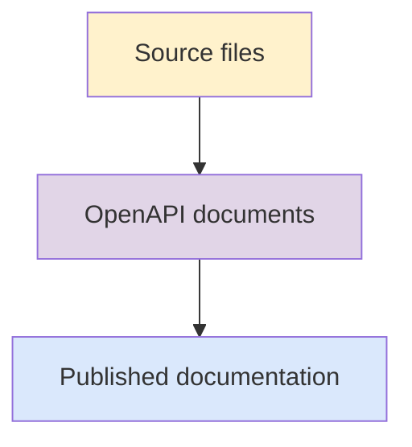
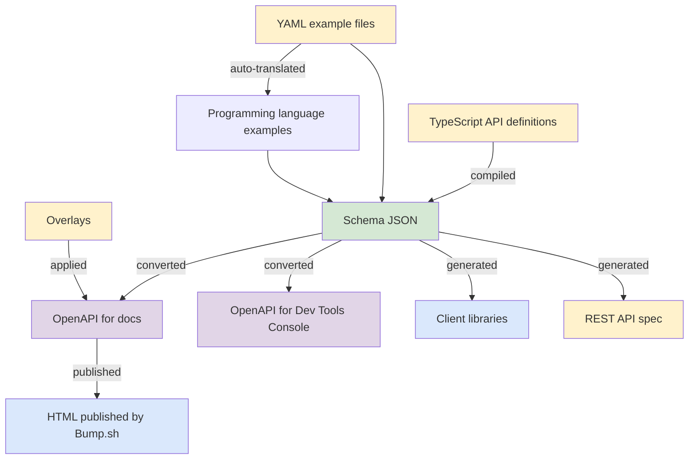

# How Elastic API docs work

This page explains at a high-level how API docs work at Elastic today, with context on how this differs from our previous approaches and where we're heading. Use this page to understand the core primitives and workflows that apply across all Elastic teams, so you can contribute effectively.

:::{tip}
The API docs use a different system to the main Elastic docs. Refer to [Contribute to Elastic docs](../index.md) for an overview of the two systems.
:::

While the implementation details [vary significantly across teams](./workflows.md), at a high level:

- We use [OpenAPI](https://spec.openapis.org/oas/latest.html) files to generate REST API documentation
- The published docs live at [elastic.co/docs/api/](https://www.elastic.co/docs/api/)

## Context and evolution

This table gives a basic overview of how API docs were produced in the past, how we do it today, and where we're heading.

This evolution seeks to elevate documentation to being a top-level citizen in the API development lifecycle.

| Era | Developer tasks | Approach | Publication |
| --- | --- | --- | --- |
| **Yesterday (8.x and earlier)** | Code + spec + manual API docs | Manual maintenance | - Published in multiple guides at [elastic.co/guide](https://www.elastic.co/guide/index.html) |
| **Today (9.0+)** | Code + spec | Docs generated from spec |- Published at [elastic.co/docs/api/](https://www.elastic.co/docs/api/)  |

## High-level process

All Elastic API docs follow this general pattern:

1. **Source files** can be:
    - TypeScript definitions with JSDoc comments (Elasticsearch)
    - Code annotations in application source (some Kibana teams)  
    - Manual YAML/JSON specifications (Logstash)
    - Generated specifications from service code (Cloud teams)
2. **OpenAPI documents** are either generated from source files or edited manually. This is the common intermediate format regardless of origin.
3. **Published documentation** lives at [elastic.co/docs/api/](https://www.elastic.co/docs/api/).

## Example: Elasticsearch

The Elasticsearch API specification workflow is particularly complex because it combines multiple source files and serves various downstream consumers. 

When adding a new API, Elasticsearch engineers first create a basic spec in the [elasticsearch repo](https://github.com/elastic/elasticsearch/tree/main/rest-api-spec). Those specs are mirrored, and made more robust and detailed in [elasticsearch-specification](https://github.com/elastic/elasticsearch-specification/tree/main/docs).

The generated Schema JSON and OpenAPI documents feed into client libraries (and their docs), the Dev Tools Console, and the [Elasticsearch API reference]({{es-apis}}) (including the [Serverless API reference]({{es-serverless-apis}})). Here's how the pipeline works:

### Input sources

Four types of files feed into the compilation process:
- **TypeScript API definitions** contain JSDoc comments with descriptions, annotations, and type information
- **JSON spec files** define endpoint URLs, HTTP methods, and parameters for each API
- **Example YAML files** provide realistic request/response demonstrations
- **OpenAPI overlays** allow customization of the generated OpenAPI documents for specific consumers

**Schema compilation:** All sources are processed and merged into a single Schema JSON file. TypeScript definitions are compiled and validated, JSON specs are merged in, and examples are parsed from YAML and attached to their corresponding endpoints. Compilation failures indicate missing types, malformed specs, or invalid examples that must be fixed.

**OpenAPI generation:** The Schema JSON is converted into OpenAPI documents optimized for different consumers. [OpenAPI overlays](https://github.com/OAI/Overlay-Specification?tab=readme-ov-file#overlay-specification) are then applied to the OpenAPI documents for API docs, to handle publisher-specific requirements or work around rendering limitations.

**Publication:** The final OpenAPI documents are published as HTML documentation via Bump.sh. A separate generation process creates client libraries directly from the Schema JSON.

## Next steps

Now that you understand how API docs work at Elastic at a high level, explore the following sections to learn how to contribute effectively.
