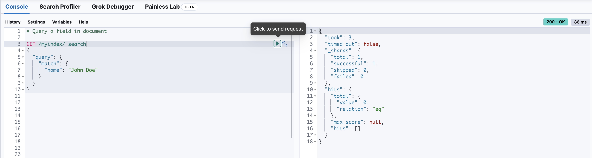
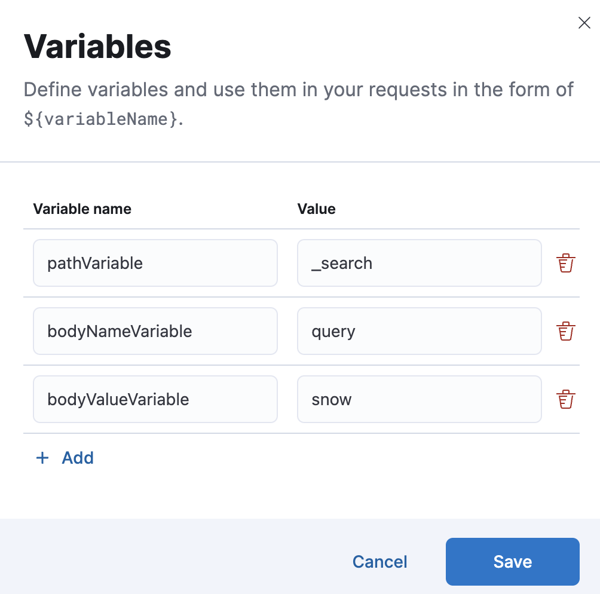

import RoughContent from '../partials/rough-content-notice.mdx'

<RoughContent />

Use the **Console** to run API requests against your Elasticsearch cluster, and view the responses.
Console is available in your Elastic UI under **Dev Tools**.

Requests are made in the left pane, and responses are displayed in the right pane.



Console also tracks your request history, so you can easily repeat requests, and provides links to API documentation.

## Write requests

**Console** understands commands in a cURL-like syntax.
For example, the following is a `GET` request to the Elasticsearch `_search` API.

```js
GET /_search
{
  "query": {
    "match_all": {}
  }
}
```

Here is the equivalent command in cURL:

```bash
curl -XGET "http://localhost:9200/_search" -d'
{
  "query": {
    "match_all": {}
  }
}'
```

When you paste a cURL command into **Console**, it is automatically converted to **Console** syntax.
If you want to see **Console** syntax in cURL, select the action icon (<DocIcon type="wrench" title="Wrench" />) and select **Copy as cURL**.
Once copied, the username and password will need to be provided for the calls to work from external environments.

### Autocomplete

When you're typing a command, **Console** makes context-sensitive suggestions.
These suggestions show you the parameters for each API and speed up your typing.
To configure your preferences for autocomplete, go to [Settings](#configure-console-settings).

### Comments

You can write comments or temporarily disable parts of a request by using double forward slashes (`//`) or pound (`#`) signs to create single-line comments.

```js
# This request searches all of your indices.
GET /_search
{
  // The query parameter indicates query context.
  "query": {
    "match_all": {} // Matches all documents.
  }
}
```

You can also use a forward slash followed by an asterisk (`/*`) to mark the beginning of multi-line
comments.
An asterisk followed by a forward slash (`*/`) marks the end.

```js
GET /_search
{
  "query": {
    /*"match_all": {
      "boost": 1.2
    }*/
    "match_none": {}
  }
}
```
### Variables

Select **Variables** to create, edit, and delete variables.



You can refer to these variables in the paths and bodies of your requests.
Each variable can be referenced multiple times.

```js
GET ${pathVariable}
{
  "query": {
    "match": {
      "${bodyNameVariable}": "${bodyValueVariable}"
    }
  }
}
```

### Auto-formatting

The auto-formatting
capability can help you format requests. Select one or more requests that you
want to format, select the action icon (<DocIcon type="wrench" title="Wrench" />),
and then select **Auto indent**.

For example, you might have a request formatted like this:


**Console** adjusts the JSON body of the request to apply the indents.


If you select **Auto indent** on a request that is already well formatted,
**Console** collapses the request body to a single line per document.
This is helpful when working with the Elasticsearch [bulk APIs](((ref))/docs-bulk.html).

## Submit requests

When you're ready to submit the request to Elasticsearch, select the green triangle.

You can select multiple requests and submit them together.
**Console** sends the requests to Elasticsearch one by one and shows the output
in the response pane. Submitting multiple requests is helpful
when you're debugging an issue or trying query
combinations in multiple scenarios.

## View API docs

To view the documentation for an API endpoint, select
the action icon (<DocIcon type="wrench" title="Wrench" />) and select
**Open documentation**.

## Get your request history

**Console** maintains a list of the last 500 requests that Elasticsearch successfully executed.
To view your most recent requests, select **History**.
If you select a request and select **Apply**, it is added to the editor at the current cursor position.

## Configure Console settings

You can configure the **Console** font size, JSON syntax, and autocomplete suggestions in **Settings**.

<DocImage size="l" url="images/console-settings.png" alt="Console Settings" />

## Get keyboard shortcuts

For a list of available keyboard shortcuts, select **Help**.

{/* ## Disable Console

If you don’t want to use **Console**, you can disable it by setting `console.ui.enabled`
to `false` in your `kibana.yml` configuration file. Changing this setting
causes the server to regenerate assets on the next startup,
which might cause a delay before pages start being served. */}