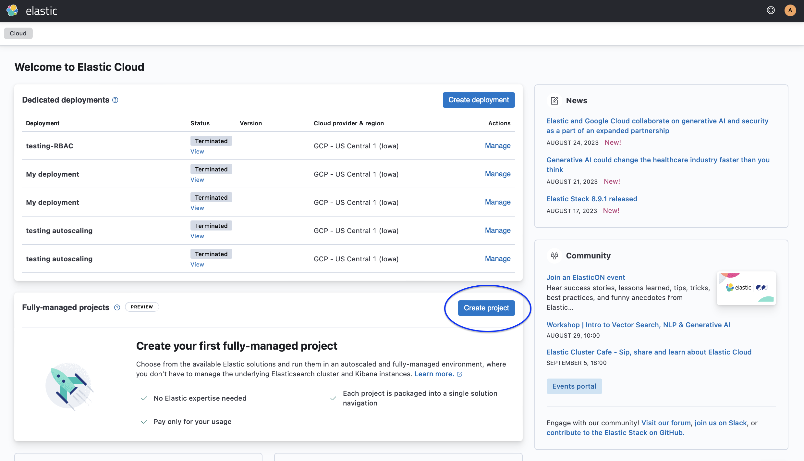
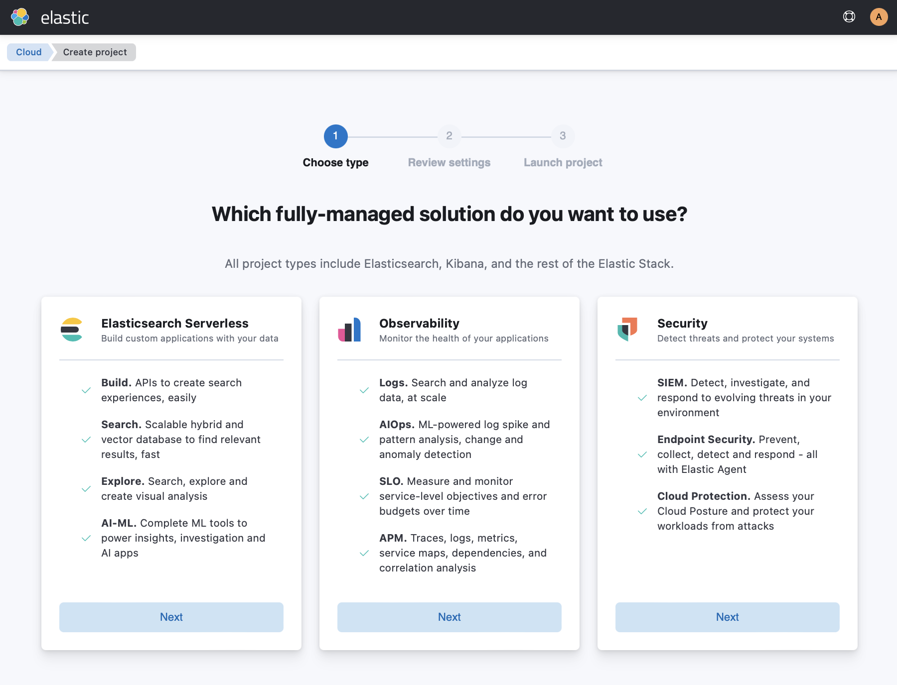
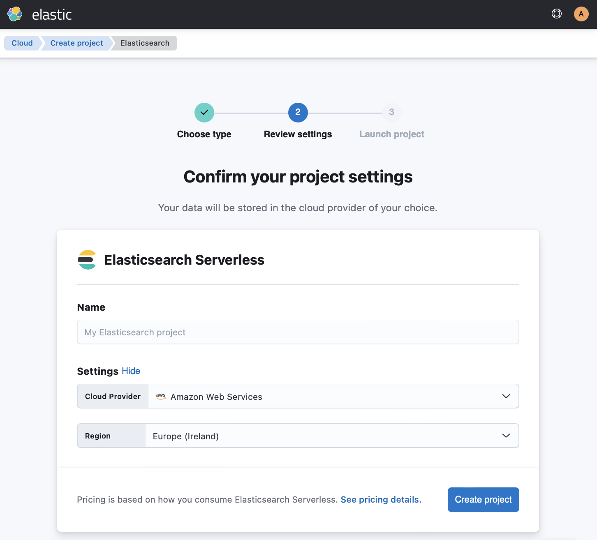

import RoughContent from '../partials/rough-content-notice.mdx'

<RoughContent />

Get started with Elasticsearch in a few steps.
Ingest, search, and explore some sample data after setting up your project:

1. [Set up project](#set-up-project)
2. [Ingest](#ingest)
3. [Search](#search)
4. [Explore](#explore)

## Set up your project

A project allows you to use one of the Elastic solutions -- Elasticsearch Serverless, Observability, Security -- and run them in an autoscaled and fully-managed environment, where you don't have to manage the underlying Elasticsearch cluster and Kibana instances.

### Create your project

1. Navigate to [cloud.elastic.co](https://cloud.elastic.co/).

1. Log in to your Elastic Cloud account and select **Create project** from the **Fully-managed projects** panel.

   

2. Choose **Elasticsearch Serverless**.

   

3. Edit your project settings.

   

   **Cloud provider**: The cloud platform where you’ll deploy your project. We currently support Amazon Web Services (AWS).

   **Region**: The cloud platform’s region where your project will live. The region should be as close as possible to the location of your data.

   You can also check [the pricing details](https://cloud.elastic.co/pricing) to see how you consume Elasticsearch Serverless.

4. Select **Create project**. It takes a few minutes before your project gets created. 

Once the project is ready, select **Continue** to open the **Get started with Elasticsearch** main page. From here, you can select your favorite language client, ingest data, and start searching and exploring within minutes.

## Ingest

Let's create an index and ingest some data!

Use the `_bulk` API to create an index called `books` and add some data to it in 
a single API call:

<DocTabs> 
  <DocTab name="curl">
    ```bash
    # Call the `_bulk` API to create the index and ingest the documents:
    curl -X POST "_bulk?pretty" -H "Content-Type: application/json" -d'
    { "index" : { "_index" : "books" } }
    {"title": "Snow Crash", "author": "Neal Stephenson", "release_date": "1992-06-01", "page_count": 470}
    { "index" : { "_index" : "books" } }
    {"title": "Revelation Space", "author": "Alastair Reynolds", "release_date": "2000-03-15", "page_count": 585}
    { "index" : { "_index" : "books" } }
    {"title": "1984", "author": "George Orwell", "release_date": "1985-06-01", "page_count": 328}
    { "index" : { "_index" : "books" } }
    {"title": "Fahrenheit 451", "author": "Ray Bradbury", "release_date": "1953-10-15", "page_count": 227}
    { "index" : { "_index" : "books" } }
    {"title": "Brave New World", "author": "Aldous Huxley", "release_date": "1932-06-01", "page_count": 268}
    { "index" : { "_index" : "books" } }
    {"title": "The Handmaid's Tale", "author": "Margaret Atwood", "release_date": "1985-06-01", "page_count": 311}
    { "index" : { "_index" : "books" } }
    {"title": "Neuromancer", "author": "William Gibson", "release_date": "1984-07-01", "page_count": 271}
    { "index" : { "_index" : "books" } }
    {"title": "Count Zero", "author": "William Gibson", "release_date": "1986-01-02", "page_count": 256}
    { "index" : { "_index" : "books" } }
    {"title": "Mona Lisa Overdrive", "author": "William Gibson", "release_date": "1988-06-01", "page_count": 251}
    { "index" : { "_index" : "books" } }
    {"title": "Virtual light", "author": "William Gibson", "release_date": "1993-09-06", "page_count": 304}
    { "index" : { "_index" : "books" } }
    {"title": "Idoru", "author": "William Gibson", "release_date": "1994-09-04", "page_count": 304}
    { "index" : { "_index" : "books" } }
    {"title": "All Tomorrow's Parties", "author": "William Gibson", "release_date": "1999-10-07", "page_count": 320}
    { "index" : { "_index" : "books" } }
    {"title": "The Colour of Magic", "author": "Terry Pratchett", "release_date": "1983-11-24", "page_count": 288}
    { "index" : { "_index" : "books" } }
    {"title": "The Light Fantastic", "author": "Terry Pratchett", "release_date": "1986-06-02", "page_count": 288}
    { "index" : { "_index" : "books" } }
    {"title": "Világló részletek", "author": "Nádas Péter", "release_date": "2017-06-08", "page_count": 1212}'
    # Check the API response to make sure that the items are indexed correctly.
    ```
  </DocTab>
  <DocTab name="Ruby">
    ```ruby
    # First, build your data:
    body = [
    { index: { _index: 'books', data: {title: "Snow Crash", author: "Neal Stephenson", release_date: "1992-06-01", page_count: 470} } },
    { index: { _index: 'books', data: {title: "Revelation Space", author: "Alastair Reynolds", release_date: "2000-03-15", page_count: 585} } },
    { index: { _index: 'books', data: {title: "1984", author: "George Orwell", release_date: "1949-06-08", page_count: 328} } },
    { index: { _index: 'books', data: {title: "Fahrenheit 451", author: "Ray Bradbury", release_date: "1953-10-15", page_count: 227} } },
    { index: { _index: 'books', data: {title: "Brave New World", author: "Aldous Huxley", release_date: "1932-06-01", page_count: 268} } },
    { index: { _index: 'books', data: {title: "The Handmaid's Tale", author: "Margaret Atwood", release_date: "1985-06-01", page_count: 311} } },
    { index: { _index: 'books', data: {title: "Neuromancer", author: "William Gibson", release_date: "1984-07-01", page_count: 271}}},
    { index: { _index: 'books', data: {title: "Count Zero", author: "William Gibson", release_date: "1986-01-02", page_count: 256}}},
    { index: { _index: 'books', data: {title: "Mona Lisa Overdrive", author: "William Gibson", release_date: "1988-06-01", page_count: 251}}},
    { index: { _index: 'books', data: {title: "Virtual light", author: "William Gibson", release_date: "1993-09-06", page_count: 304}}},
    { index: { _index: 'books', data: {title: "Idoru", author: "William Gibson", release_date: "1994-09-04", page_count: 304}}},
    { index: { _index: 'books', data: {title: "All Tomorrow's Parties", author: "William Gibson", release_date: "1999-10-07", page_count: 320}}},
    { index: { _index: 'books', data: {title: "The Colour of Magic", author: "Terry Pratchett", release_date: "1983-11-24", page_count: 288}}},
    { index: { _index: 'books', data: {title: "The Light Fantastic", author: "Terry Pratchett", release_date: "1986-06-02", page_count: 288}}},
    { index: { _index: 'books', data: {title: "Világló részletek", author: "Nádas Péter", release_date: "2017-06-08", page_count: 1212}}}
    ]
    # Then ingest the data via the bulk API:
    > response = client.bulk(body: body)
    # You can check the response if the items are indexed and have an ID:
    > response['items']
    =>
    [{"index"=>{"_index"=>"books", "_id"=>"Pdink4cBmDx329iqhzM2", "_version"=>1, "result"=>"created", "_shards"=>{"total"=>2, "successful"=>1, "failed"=>0}, "_seq_no"=>0, "_primary_term"=>1, "status"=>201}},
      {"index"=>{"_index"=>"books", "_id"=>"Ptink4cBmDx329iqhzM2", "_version"=>1, "result"=>"created", "_shards"=>{"total"=>2, "successful"=>1, "failed"=>0}, "_seq_no"=>1, "_primary_term"=>1, "status"=>201}},
      {"index"=>{"_index"=>"books", "_id"=>"P9ink4cBmDx329iqhzM2", "_version"=>1, "result"=>"created", "_shards"=>{"total"=>2, "successful"=>1, "failed"=>0}, "_seq_no"=>2, "_primary_term"=>1, "status"=>201}},
      {"index"=>{"_index"=>"books", "_id"=>"QNink4cBmDx329iqhzM2", "_version"=>1, "result"=>"created", "_shards"=>{"total"=>2, "successful"=>1, "failed"=>0}, "_seq_no"=>3, "_primary_term"=>1, "status"=>201}},
      {"index"=>{"_index"=>"books", "_id"=>"Qdink4cBmDx329iqhzM2", "_version"=>1, "result"=>"created", "_shards"=>{"total"=>2, "successful"=>1, "failed"=>0}, "_seq_no"=>4, "_primary_term"=>1, "status"=>201}},
      {"index"=>{"_index"=>"books", "_id"=>"Qtink4cBmDx329iqhzM2", "_version"=>1, "result"=>"created", "_shards"=>{"total"=>2, "successful"=>1, "failed"=>0}, "_seq_no"=>5, "_primary_term"=>1, "status"=>201}},
      {"index"=>{"_index"=>"books", "_id"=>"Adink4cBmDx329iqhzM2", "_version"=>1, "result"=>"created", "_shards"=>{"total"=>2, "successful"=>1, "failed"=>0}, "_seq_no"=>6, "_primary_term"=>1, "status"=>201}},
      {"index"=>{"_index"=>"books", "_id"=>"Pbink4cBmDx329iqhzM2", "_version"=>1, "result"=>"created", "_shards"=>{"total"=>2, "successful"=>1, "failed"=>0}, "_seq_no"=>7, "_primary_term"=>1, "status"=>201}},
      {"index"=>{"_index"=>"books", "_id"=>"P9knk4cBmDx329iqhzM2", "_version"=>1, "result"=>"created", "_shards"=>{"total"=>2, "successful"=>1, "failed"=>0}, "_seq_no"=>8, "_primary_term"=>1, "status"=>201}},
      {"index"=>{"_index"=>"books", "_id"=>"QNisk4cBmDx329iqhzM2", "_version"=>1, "result"=>"created", "_shards"=>{"total"=>2, "successful"=>1, "failed"=>0}, "_seq_no"=>9, "_primary_term"=>1, "status"=>201}},
      {"index"=>{"_index"=>"books", "_id"=>"Qdinl4cBmDx329iqhzM2", "_version"=>1, "result"=>"created", "_shards"=>{"total"=>2, "successful"=>1, "failed"=>0}, "_seq_no"=>10, "_primary_term"=>1, "status"=>201}},
      {"index"=>{"_index"=>"books", "_id"=>"Qtink3cBmDx329iqhzM2", "_version"=>1, "result"=>"created", "_shards"=>{"total"=>2, "successful"=>1, "failed"=>0}, "_seq_no"=>11, "_primary_term"=>1, "status"=>201}},
      {"index"=>{"_index"=>"books", "_id"=>"Paink4cBmDx329iqhzM2", "_version"=>1, "result"=>"created", "_shards"=>{"total"=>2, "successful"=>1, "failed"=>0}, "_seq_no"=>12, "_primary_term"=>1, "status"=>201}},
      {"index"=>{"_index"=>"books", "_id"=>"Gtine4cBmDx329iqhzM2", "_version"=>1, "result"=>"created", "_shards"=>{"total"=>2, "successful"=>1, "failed"=>0}, "_seq_no"=>13, "_primary_term"=>1, "status"=>201}},
      {"index"=>{"_index"=>"books", "_id"=>"H9inc4cBmDx329iqhzM2", "_version"=>1, "result"=>"created", "_shards"=>{"total"=>2, "successful"=>1, "failed"=>0}, "_seq_no"=>14, "_primary_term"=>1, "status"=>201}}]
    ```
  </DocTab>
</DocTabs>

## Search

Now search for documents in the `books` index that contain the word `snow`:

<DocTabs>
  <DocTab name="curl">
    Run a search using the `_search` API:

    ```bash
    curl -X GET '/books/_search' -H 'Content-Type: application/json' -d'
    {
        "query": {
            "match": { "_all": "snow" }
        }
    }'
    ```
  </DocTab>
  <DocTab name="Ruby">
    Run a search using the `search` API:

    ```ruby
    response = client.search(index: 'books', q: 'snow')
    response['hits']['hits']
    ```

    Result:
    
    ```ruby
    [{"_index"=>"books", "_id"=>"Pdink4cBmDx329iqhzM2", "_score"=>1.5904956, "_source"=>{"title"=>"Snow Crash", "author"=>"Neal Stephenson", "release_date"=>"1992-06-01", "page_count"=>470}}]
    ```
  </DocTab>
</DocTabs>

## Explore

* Select **Discover**.

* Write some queries to explore the data (potentially with ES|QL).

* Select **Dashboard**.

* Create a visualization.