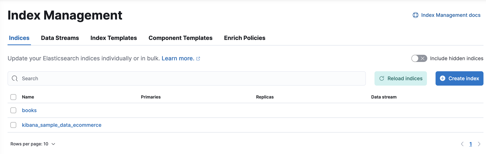

import RoughContent from '../../partials/rough-content-notice.mdx'

<RoughContent />

This content applies to: <DocBadge template="elasticsearch" slug="/serverless/elasticsearch/what-is-elasticsearch-serverless" /> <DocBadge template="observability" slug="/serverless/observability/what-is-observability-serverless" /> <DocBadge template="security" slug="/serverless/security/what-is-security-serverless" /> 

<div id="index-mgmt"></div>

Elastic's **((index-manage-app))** features are an easy, convenient way to manage your
cluster's indices, data streams, and index templates.
Practicing good index management ensures your data is stored correctly and in the most cost-effective way possible.
{/* <DocLink id="enElasticsearchReferenceDataStreams">data streams</DocLink> , and <DocLink id="enElasticsearchReferenceIndexTemplates">index
templates</DocLink>. */}

{/* <div id="index-mgmt-wyl"></div>

## What you'll learn

You'll learn how to:

* View and edit index settings.
* View mappings and statistics for an index.
* Perform index-level operations, such as refreshes.
* View and manage data streams.
* Create index templates to automatically configure new data streams and indices.

<div id="index-mgm-req-permissions"></div>

## Required permissions

If you use ((es)) ((security-features)), the following <DocLink id="enElasticsearchReferenceSecurityPrivileges">security privileges</DocLink> are required:

* The `monitor` cluster privilege to access Elastic's **((index-manage-app))** features.
* The `view_index_metadata` and `manage` index privileges to view a data stream
    or index's data.

* The `manage_index_templates` cluster privilege to manage index templates.

To add these privileges, go to **Stack Management > Security > Roles**.

<div id="view-edit-indices"></div> */}

## View and edit indices

Go to **((index-manage-app))** in **((project-settings))** or **((project-settings)) > ((manage-app))**.


{/* TO-DO: This screenshot needs to be refreshed since it doesn't show all of the pertinent tabs */}

The **((index-manage-app))** page contains an overview of your indices.
{/* Badges indicate if an index is a <DocLink id="enElasticsearchReferenceCcrPutFollow">follower index</DocLink>, a
<DocLink id="enElasticsearchReferenceRollupGetRollupIndexCaps">rollup index</DocLink>, or <DocLink id="enElasticsearchReferenceUnfreezeIndexApi">frozen</DocLink>. Clicking a badge narrows the list to only indices of that type. */}
You can also filter indices using the search bar.

You can drill down into each index to investigate the index settings, mappings, and statistics.
From this view, you can also edit the index settings. 
{/* <DocLink id="enElasticsearchReferenceIndexModules" section="index-settings">settings</DocLink>, <DocLink id="enElasticsearchReferenceMapping">mapping</DocLink> */}

To view and explore the documents within an index, click the compass icon <DocIcon type="discoverApp" title="Discover icon" /> next to the index name to open Discover.

{/*  */}
{/* TO-DO: This screenshot needs to be refreshed since it doesn't show the appropriate context */}

## Perform index-level operations

Use the **Manage** menu to perform index-level operations.
This menu is available in the index details view, or when you select the checkbox of one or more indices on the overview page.

{/*
TBD: Seems like only "delete index" option exists in serverless
The menu includes the following actions:

* <DocLink id="enElasticsearchReferenceIndicesClose">**Close index**</DocLink>
* <DocLink id="enElasticsearchReferenceIndicesForcemerge">**Force merge index**</DocLink>
* <DocLink id="enElasticsearchReferenceIndicesRefresh">**Refresh index**</DocLink>
* <DocLink id="enElasticsearchReferenceIndicesFlush">**Flush index**</DocLink>
* <DocLink id="enElasticsearchReferenceIndicesDeleteIndex">**Delete index**</DocLink>
* <DocLink id="enElasticsearchReferenceSetUpLifecyclePolicy">**Add lifecycle policy**</DocLink>
*/}

<div id="manage-data-streams"></div>

## Manage data streams

The **Data Streams** view lists your data streams and lets you examine or delete them.

To view more information about a data stream, such as its generation or its
current index lifecycle policy, click the stream's name.

To view and explore the data within a data stream, click the compass icon <DocIcon type="discoverApp" title="Discover icon" /> next to the index name to open Discover.


To view information about the stream's backing indices, click the number in the **Indices** column.

{/*
TO-DO: This screenshot is not accurate since it contains several toggles that don't exist in serverless.

*/}

<div id="manage-index-templates"></div>

## Manage index templates

The **Index Templates** view lists your templates and lets you examine, edit, clone, and delete them. 
Changes made to an index template do not affect existing indices.


{/* TO-DO: This screenshot is missing some tabs that exist in serverless */}

If you don't have any templates, you can create one using the **Create template** wizard.

{/*
TO-DO:This page is missing information about the "Component templates" and "Enrich policies" tabs.
*/}

{/*
TO-DO: This walkthrough needs to be tested and updated for serverless.
### Try it: Create an index template

In this tutorial, you'll create an index template and use it to configure two
new indices.

**Step 1. Add a name and index pattern**

1. In the **Index Templates** view, open the **Create template** wizard.

   

1. In the **Name** field, enter `my-index-template`.

1. Set **Index pattern** to `my-index-*` so the template matches any index
    with that index pattern.

1. Leave **Data Stream**, **Priority**, **Version**, and **_meta field** blank or as-is.

**Step 2. Add settings, mappings, and aliases**

1. Add <DocLink id="enElasticsearchReferenceIndicesComponentTemplate">component templates</DocLink> to your index template.

    Component templates are pre-configured sets of mappings, index settings, and
    aliases you can reuse across multiple index templates. Badges indicate
    whether a component template contains mappings (*M*), index settings (*S*),
    aliases (*A*), or a combination of the three.

    Component templates are optional. For this tutorial, do not add any component
    templates.

    

1. Define index settings. These are optional. For this tutorial, leave this
    section blank.

1. Define a mapping that contains an <DocLink id="enElasticsearchReferenceObject">object</DocLink> field named `geo` with a
    child  <DocLink id="enElasticsearchReferenceGeoPoint">`geo_point`</DocLink> field named `coordinates`:

   

    Alternatively, you can click the **Load JSON** link and define the mapping as JSON:

    ```js
    {
    "properties": {
    "geo": {
    "properties": {
    "coordinates": {
    "type": "geo_point"
    }
    }
    }
    }

    ```
    \\ NOTCONSOLE

    You can create additional mapping configurations in the **Dynamic templates** and
    **Advanced options** tabs. For this tutorial, do not create any additional
    mappings.

1. Define an alias named `my-index`:

    ```js
    {
    "my-index": {}
    }
    ```
    \\ NOTCONSOLE

1. On the review page, check the summary. If everything looks right, click
    **Create template**.

**Step 3. Create new indices**

You’re now ready to create new indices using your index template.

1. Index the following documents to create two indices:
    `my-index-000001` and `my-index-000002`.

    ```console
    POST /my-index-000001/_doc
    {
    "@timestamp": "2019-05-18T15:57:27.541Z",
    "ip": "225.44.217.191",
    "extension": "jpg",
    "response": "200",
    "geo": {
    "coordinates": {
    "lat": 38.53146222,
    "lon": -121.7864906
    }
    },
    "url": "https://media-for-the-masses.theacademyofperformingartsandscience.org/uploads/charles-fullerton.jpg"
    }

    POST /my-index-000002/_doc
    {
    "@timestamp": "2019-05-20T03:44:20.844Z",
    "ip": "198.247.165.49",
    "extension": "php",
    "response": "200",
    "geo": {
    "coordinates": {
    "lat": 37.13189556,
    "lon": -76.4929875
    }
    },
    "memory": 241720,
    "url": "https://theacademyofperformingartsandscience.org/people/type:astronauts/name:laurel-b-clark/profile"
    }
    ```

1. Use the <DocLink id="enElasticsearchReferenceIndicesGetIndex">get index API</DocLink> to view the configurations for the
    new indices. The indices were configured using the index template you created
    earlier.

    ```console
    GET /my-index-000001,my-index-000002
    ```
    \\ TEST[continued]
 */}
