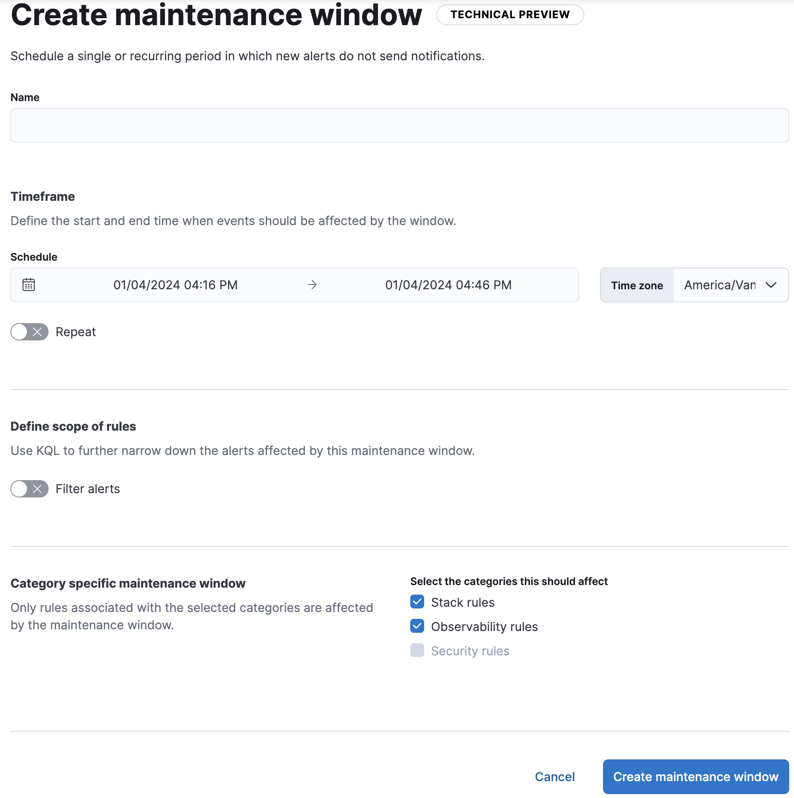

<DocBadge template="technical preview" />
This content applies to: <DocBadge template="observability" slug="/serverless/observability/what-is-observability-serverless" /> <DocBadge template="security" slug="/serverless/security/what-is-security-serverless" />

<DocCallOut template="technical_preview" />
You can schedule single or recurring maintenance windows to temporarily reduce rule notifications.
For example, a maintenance window prevents false alarms during planned outages.

{/*
TBD: Do they affect all rules in the project or is it finer control in serverless?
Maintenance windows affect all rules in all ((kib)) apps and spaces.
*/}
Alerts continue to be generated, however notifications are suppressed as follows:

- When an alert occurs during a maintenance window, there are no notifications.
When the alert recovers, there are no notifications--even if the recovery occurs after the maintenance window ends.
- When an alert occurs before a maintenance window and recovers during or after the maintenance window, notifications are sent as usual.

{/*
TBD: What RBAC requirements exist in serverless?
## Configure access to maintenance windows

To use maintenance windows, you must have the appropriate [subscription](((subscriptions))) and ((kib)) feature privileges.

- To have full access to maintenance windows, you must have `All` privileges for the **Management → Maintenance Windows*** feature.
- To have view-only access to maintenance windows, you must have `Read` privileges for the **Management → Maintenance Windows* feature.

For more details, refer to <DocLink id="enKibanaKibanaPrivileges">((kib)) privileges</DocLink>.
*/}

## Create and manage maintenance windows

In **((project-settings)) → ((manage-app)) → ((maint-windows-app))** you can create, edit, and archive maintenance windows.

When you create a maintenance window, you must provide a name and a schedule.
You can optionally configure it to repeat daily, monthly, yearly, or on a custom interval.

A maintenance window can have any one of the following statuses:

- `Upcoming`: It will run at the scheduled date and time.
- `Running`: It is running.
- `Finished`: It ended and does not have a repeat schedule.
- `Archived`: It is archived. In a future release, archived maintenance windows will be queued for deletion.

When you view alert details in ((kib)), each alert shows unique identifiers for maintenance windows that affected it.