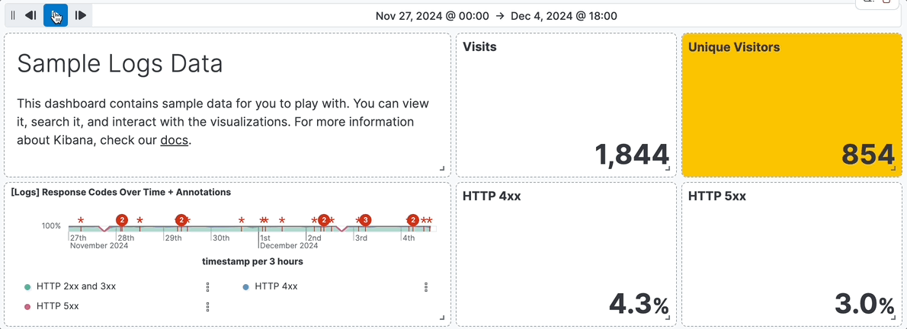

---
applies_to:
  stack: ga
  serverless: ga
mapped_pages:
  - https://www.elastic.co/guide/en/kibana/current/add-controls.html
---

# Add filter controls [add-controls]

**Controls** are interactive panels that you add to your dashboards to help viewers filter and display only the data they want to explore quicker. Controls apply to all relevant panels in a dashboard.

There are three types of controls:

* [**Options list**](#create-and-add-options-list-and-range-slider-controls) — Adds a dropdown that allows to filter data by selecting one or more values.
  For example, if you are using the **[Logs] Web Traffic** dashboard from the sample web logs data, you can add an options list for the `machine.os.keyword` field that allows you to display only the logs generated from `osx` and `ios` operating systems.
  

* [**Range slider**](#create-and-add-options-list-and-range-slider-controls) — Adds a slider that allows to filter the data within a specified range of values. This type of control only works with numeric fields.
  For example, if you are using the **[Logs] Web Traffic** dashboard from the sample web logs data, you can add a range slider for the `hour_of_day` field that allows you to display only the log data from 9:00AM to 5:00PM.
  

* [**Time slider**](#add-time-slider-controls) — Adds a time range slider that allows to filter the data within a specified range of time, advance the time range backward and forward by a unit that you can define, and animate your change in data over the specified time range.
  For example, you are using the **[Logs] Web Traffic** dashboard from the sample web logs data, and the global time filter is **Last 7 days**. When you add the time slider, you can click the previous and next buttons to advance the time range backward or forward, and click the play button to watch how the data changes over the last 7 days.
  

## Create and add Options list and Range slider controls [create-and-add-options-list-and-range-slider-controls]

To add interactive Options list and Range slider controls, create the controls, then add them to your dashboard.

1. Open or create a new dashboard.
2. In **Edit** mode, select **Controls** > **Add control** in the dashboard toolbar.
   

3. On the **Create control** flyout, from the **Data view** dropdown, select the data view that contains the field you want to use for the **Control**.
4. In the **Field** list, select the field you want to filter on.
5. Under **Control type**, select whether the control should be an **Options list** or a **Range slider**.
   ::::{tip}
   Range sliders are for Number type fields only.
   ::::

6. Define how you want the control to appear:

    * **Label**: Overwrite the default field name with a clearer and self-explanatory label.
    * **Minimum width**: How much horizontal space does the control occupies. The final width can vary depending on the other controls and their own width setting.
    * **Expand width to fit available space**: Expand the width of the control to fit the available horizontal space on the dashboard.

7. Specify the additional settings:

    * For Options lists:

        * Define whether users can select multiple values to filter with the control, or only one.
        * For Options list controls on *string* and *IP address* type fields, you can define how the control’s embedded search should behave:

            * **Prefix**: Show options that *start with* the entered value.
            * **Contains**: Show options that *contain* the entered value. This setting option is only available for *string* type fields. Results can take longer to show with this option.
            * **Exact**: Show options that are a 100% match with the entered value.

              ::::{tip}
              The search is not case sensitive. For example, searching for `ios` would still retrieve `iOS` if that value exists.
              ::::

        * **Ignore timeout for results** delays the display of the list of values to when it is fully loaded. This option is useful for large data sets, to avoid missing some available options in case they take longer to load and appear when using the control.

    * For Range sliders, set the step size. The step size determines the number of steps of the slider. The smaller the step size is, the more steps there is in the slider.

8. Click **Save and close**. The control can now be used.
9. Consider the position of the control if you have several controls active on the dashboard. Controls are applied from left to right, which can change the options available depending on their position when the [Chain controls](#configure-controls-settings) setting is enabled.
10. Save the dashboard.

## Add time slider controls [add-time-slider-controls]

You can add one interactive time slider control to a dashboard.

1. Open or create a new dashboard.
2. In **Edit** mode, select **Controls** > **Add time slider control**.
   

3. The time slider control uses the time range from the global time filter. To change the time range in the time slider control, [change the global time filter](../query-filter/filtering.md).
4. Save the dashboard. The control can now be used.

## Configure the controls settings [configure-controls-settings]

Several settings that apply to all controls of the same dashboard are available.

1. In **Edit** mode, select **Controls** > **Settings**.
   

2. On the **Control settings** flyout, configure the following settings:

    * **Label position** — Specify where the control label appears.
    * **Filtering** settings:

        * **Apply global filters to controls** — Define whether controls should ignore or apply any filter specified in the main filter bar of the dashboard.
        * **Apply global time range to controls** — Define whether controls should ignore or apply the main time range specified for the dashboard. Note that [time slider controls](#add-time-slider-controls) rely on the global time range and don’t work properly when this option is disabled.

    * **Selections** settings:

        * **Validate user selections** — When selected, any selected option that results in no data is ignored.
        * **Chain controls** — When selected, controls are applied sequentially from left to right, and line by line. Any selected options in one control narrows the available options in the next control.
        * **Apply selections automatically** — The dashboard is updated dynamically when options are selected in controls. When this option is disabled, users first need to **Apply** their control selection before they are applied to the dashboard.

    * To remove all controls from the dashboard, click **Delete all**.

3. Click **Save and close** to apply the changes.

## Edit Options list and Range slider control settings [edit-controls]

Change the settings for the Options list and Range slider controls.

1. Hover over the control you want to edit, then click .
2. On the **Edit control** flyout, change the options, then click **Save and close**.

## Remove controls [remove-controls]

Remove controls from your dashboard.

1. Hover over the control you want to remove, then click .
2. On the **Delete control?** window, click **Delete**.
