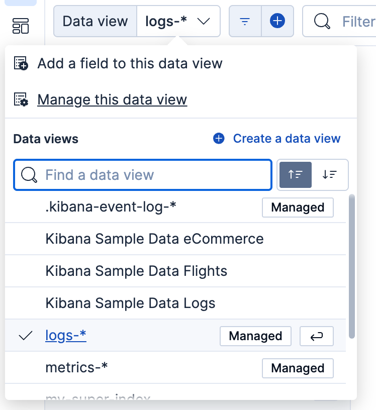

---
mapped_pages:
  - https://www.elastic.co/guide/en/kibana/current/data-views.html
  - https://www.elastic.co/guide/en/serverless/current/data-views.html
  - https://www.elastic.co/guide/en/kibana/current/managing-data-views.html
applies_to:
  stack: ga
  serverless: ga
products:
  - id: kibana
  - id: cloud-serverless
---

# Data views [data-views]

By default, analytics features such as Discover require a {{data-source}} to access the {{es}} data that you want to explore. A {{data-source}} can point to one or more indices, [data streams](../../manage-data/data-store/data-streams.md), or [index aliases](/manage-data/data-store/aliases.md). For example, a {{data-source}} can point to your log data from yesterday, or all indices that contain your data.

::::{note}
In certain apps, you can also query your {{es}} data using [{{esql}}](elasticsearch://reference/query-languages/esql.md). With {{esql}}, data views aren't required.
::::


## Permissions [data-views-read-only-access]

* Creating and managing data views requires [a role](../../deploy-manage/users-roles/cluster-or-deployment-auth/defining-roles.md) with the following permissions:
  - `Data View Management` {{kib}} privilege.
  - `view_index_metadata` {{es}} privilege.
* If a read-only indicator appears, you have insufficient privileges to create or save {{data-sources}}. In addition, the buttons to create {{data-sources}} or save existing {{data-sources}} are not visible.
* {applies_to}`stack: ga 9.2` Some data views are exclusively configured and **managed** by Elastic. You can view and use these managed data views, but you can't edit them. If you'd like to use a modified version of a managed data view, you can [duplicate it](#duplicate-managed-data-view) and edit that new copy as needed.


## Create a data view [settings-create-pattern]

If you collected data using one of the {{kib}} [ingest options](../../manage-data/ingest.md), uploaded a file, or added sample data, you get a {{data-source}} created automatically, and can start exploring your data. If you loaded your own data, follow these steps to create a {{data-source}}.

1. Open **Lens** or **Discover**, and then open the data view menu.

   :::{image} /explore-analyze/images/kibana-discover-data-view.png
   :alt: How to set the {{data-source}} in Discover
   :screenshot:
   :width: 50%
   :::

2. Click **Create a {{data-source}}**.
3. Give your {{data-source}} a name.
4. Start typing in the **Index pattern** field, and {{kib}} looks for the names of indices, data streams, and aliases that match your input. You can view all available sources or only the sources that the data view targets.
   

    * To match multiple sources, use a wildcard (*). `filebeat-*` matches `filebeat-apache-a`, `filebeat-apache-b`, and so on.
    * To match multiple single sources, enter their names, separated by a comma.  Do not include a space after the comma. `filebeat-a,filebeat-b` matches two indices.
    * To exclude a source, use a minus sign (-), for example, `-test3`.

5. Open the **Timestamp field** dropdown, and then select the default field for filtering your data by time.

    * If you don’t set a default time field, you can’t use global time filters on your dashboards. This is useful if you have multiple time fields and want to create dashboards that combine visualizations based on different timestamps.
    * If your index doesn’t have time-based data, choose **I don’t want to use the time filter**.

6. Click **Show advanced settings** to:

    * Display hidden and system indices.
    * Specify your own {{data-source}} name. For example, enter your {{es}} index alias name.

7. $$$reload-fields$$$ Click **Save {{data-source}} to {{kib}}**.

    You can manage your data views from the **Management** menu.


### Create a temporary {{data-source}} [_create_a_temporary_data_source]

Want to explore your data or create a visualization without saving it as a data view? Select **Use without saving** in the **Create {{data-source}}** form in **Discover** or **Lens**. With a temporary {{data-source}}, you can add fields and create an {{es}} query alert, just like you would a regular {{data-source}}.  Your work won’t be visible to others in your space.

A temporary {{data-source}} remains in your space until you change apps, or until you save it.

:::{image} /explore-analyze/images/ad-hoc-data-view.gif
:alt: how to create an ad-hoc data view
:screenshot:
:::

::::{note}
Temporary {{data-sources}} are not available in the **Management** menu.
::::


### Use {{data-sources}} with rolled up data [rollup-data-view]
```{applies_to}
serverless: unavailable
stack: deprecated
```

::::{admonition}
:class: warning

Rollups are deprecated. Use [downsampling](../../manage-data/data-store/data-streams/downsampling-time-series-data-stream.md) instead.
::::


A {{data-source}} can match one rollup index.  For a combination rollup {{data-source}} with both raw and rolled up data, use the standard notation:

```ts
rollup_logstash,kibana_sample_data_logs
```

For an example, refer to [Create and visualize rolled up data](/manage-data/lifecycle/rollup/getting-started-kibana.md#rollup-data-tutorial).


### Use {{data-sources}} with {{ccs}} [management-cross-cluster-search]
```{applies_to}
serverless: unavailable
stack: ga
```

If your {{es}} clusters are configured for [{{ccs}}](../../explore-analyze/cross-cluster-search.md), you can create a {{data-source}} to search across the clusters of your choosing. Specify data streams, indices, and aliases in a remote cluster using the following syntax:

```ts
<remote_cluster_name>:<target>
```

To query {{ls}} indices across two {{es}} clusters that you set up for {{ccs}}, named `cluster_one` and `cluster_two`:

```ts
 cluster_one:logstash-*,cluster_two:logstash-*
```

Use wildcards in your cluster names to match any number of clusters. To search {{ls}} indices across clusters named `cluster_foo`, `cluster_bar`, and so on:

```ts
cluster_*:logstash-*
```

To query across all {{es}} clusters that have been configured for {{ccs}}, use a standalone wildcard for your cluster name:

```ts
*:logstash-*
```

To match indices starting with `logstash-`, but exclude those starting with `logstash-old`, from all clusters having a name starting with `cluster_`:

```ts
cluster_*:logstash-*,cluster_*:-logstash-old*
```

Excluding a cluster avoids sending any network calls to that cluster. To exclude a cluster with the name `cluster_one`:

```ts
cluster_*:logstash-*,-cluster_one:*
```

Once you configure a {{data-source}} to use the {{ccs}} syntax, all searches and aggregations using that {{data-source}} in {{kib}} take advantage of {{ccs}}.

For more information, refer to [Excluding clusters or indicies from cross-cluster search](../../explore-analyze/cross-cluster-search.md#exclude-problematic-clusters).


## Delete a {{data-source}} [delete-data-view]

When you delete a {{data-source}}, you cannot recover the associated field formatters, runtime fields, source filters, and field popularity data. Deleting a {{data-source}} does not remove any indices or data documents from {{es}}.

::::{warning}
Deleting a {{data-source}} breaks all visualizations, saved Discover sessions, and other saved objects that reference the data view.
::::


1. Go to the **Data Views** management page using the navigation menu or the [global search field](../../explore-analyze/find-and-organize/find-apps-and-objects.md).
2. Find the {{data-source}} that you want to delete, and then click  in the **Actions** column.


## Data view field cache [data-view-field-cache]

The browser caches {{data-source}} field lists for increased performance. This is particularly impactful for {{data-sources}} with a high field count that span a large number of indices and clusters. The field list is updated every couple of minutes in typical {{kib}} usage. Alternatively, use the refresh button on the {{data-source}} management detail page to get an updated field list. A force reload of {{kib}} has the same effect.

The field list may be impacted by changes in indices and user permissions.

## Manage data views [managing-data-views]

To customize the fields in your data view, you can add runtime fields to the existing documents, add scripted fields to compute data on the fly, and change how {{kib}} displays the data view fields.


### Explore your data with runtime fields [runtime-fields]

Runtime fields are fields that you add to documents after you’ve ingested your data, and are evaluated at query time. With runtime fields, you allow for a smaller index and faster ingest time so that you can use less resources and reduce your operating costs. You can use runtime fields anywhere data views are used, for example, you can explore runtime fields in **Discover** and create visualizations with runtime fields for your dashboard.

With runtime fields, you can:

* Define fields for a specific use case without modifying the underlying schema.
* Override the returned values from index fields.
* Start working on your data without understanding the structure.
* Add fields to existing documents without reindexing your data.

::::{warning}
Runtime fields can impact {{kib}} performance. When you run a query, {{es}} uses the fields you index first to shorten the response time. Index the fields that you commonly search for and filter on, such as `timestamp`, then use runtime fields to limit the number of fields {{es}} uses to calculate values.
::::


For detailed information on how to use runtime fields with {{es}}, refer to [Runtime fields](../../manage-data/data-store/mapping/runtime-fields.md).


#### Add runtime fields [create-runtime-fields]

To add runtime fields to your data views, open the data view you want to change, then define the field values by emitting a single value using the [Painless scripting language](../../explore-analyze/scripting/modules-scripting-painless.md). You can also add runtime fields in [**Discover**](../../explore-analyze/discover/discover-get-started.md#add-field-in-discover) and [**Lens**](../../explore-analyze/visualize/lens.md#change-the-fields).

1. Go to the **Data Views** management page using the navigation menu or the [global search field](../../explore-analyze/find-and-organize/find-apps-and-objects.md).
2. Select the data view that you want to add the runtime field to, then click **Add field**.
3. Enter the field **Name**, then select the **Type**.
4. Select **Set custom label**, then enter the label you want to display where the data view is used, such as **Discover**.
5. Select **Set value**, then define the script. The script must match the **Type**, or the data view fails anywhere it is used.
6. To help you define the script, use the **Preview**:

    * To view the other available fields, use the **Document ID** arrows.
    * To filter the fields list, enter the keyword in **Filter fields**.
    * To pin frequently used fields to the top of the list, hover over the field, then click .

7. Click **Create field**.

:::{warning}
Runtime fields created against a data view are not applied to the underlying index mapping in {{es}}.
:::


#### Runtime field examples [runtime-field-examples]

Try the runtime field examples on your own using the [**Sample web logs**](../../explore-analyze/index.md#gs-get-data-into-kibana) data.


#### Return a keyword value [simple-hello-world-example]

Return `Hello World!`:

```text
emit("Hello World!");
```


#### Perform a calculation on a single field [perform-a-calculation-on-a-single-field]

Calculate kilobytes from bytes:

```text
emit(doc['bytes'].value / 1024)
```


#### Return a substring [return-substring]

Return the string that appears after the last slash in the URL:

```text
def path = doc["url.keyword"].value;
if (path != null) {
    int lastSlashIndex = path.lastIndexOf('/');
    if (lastSlashIndex > 0) {
        emit(path.substring(lastSlashIndex+1));
    return;
    }
}
emit("");
```


#### Return multiple fields with a composite runtime field [composite-runtime-field]

A single runtime field can also produce multiple subfields when the type `Composite` is selected. The script editor provides default types that can be customized for each subfields.

Return `keyword` and `double` type subfields. Note that the first argument for `emit` is the name of the subfield.

```text
emit('subfield_a', 'Hello');
emit('subfield_b', 42);
```


#### Replace nulls with blanks [replace-nulls-with-blanks]

Replace `null` values with `None`:

```text
def source = doc['referer'].value;
if (source != null) {
  emit(source);
  return;
}
else {
  emit("None");
}
```

Specify the operating system condition:

```text
def source = doc['machine.os.keyword'].value;
if (source != "") {
  emit(source);
}
else {
  emit("None");
}
```


#### Manage runtime fields [manage-runtime-fields]

Edit the settings for runtime fields, or remove runtime fields from data views.

1. Go to the **Data Views** management page using the navigation menu or the [global search field](../../explore-analyze/find-and-organize/find-apps-and-objects.md).
2. Select the data view that contains the runtime field you want to manage, then open the runtime field edit options or delete the runtime field.


### Add scripted fields to data views [scripted-fields]

::::{admonition} Deprecated in 7.13.
:class: warning

Use [runtime fields](../../manage-data/data-store/mapping/runtime-fields.md) instead of scripted fields. Runtime fields support Painless scripting and provide greater flexibility. You can also use the [Elasticsearch Query Language (ES|QL)](elasticsearch://reference/query-languages/esql.md) to compute values directly at query time.
::::


Scripted fields compute data on the fly from the data in your {{es}} indices. The data is shown on the Discover tab as part of the document data, and you can use scripted fields in your visualizations. You query scripted fields with the [{{kib}} query language](../../explore-analyze/query-filter/languages/kql.md), and can filter them using the filter bar. The scripted field values are computed at query time, so they aren’t indexed and cannot be searched using the {{kib}} default query language.

::::{warning}
Computing data on the fly with scripted fields can be very resource intensive and can have a direct impact on {{kib}} performance. Keep in mind that there’s no built-in validation of a scripted field. If your scripts are buggy, you’ll get exceptions whenever you try to view the dynamically generated data.
::::


When you define a scripted field in {{kib}}, you have a choice of the [Lucene expressions](../../explore-analyze/scripting/modules-scripting-expression.md) or the [Painless](../../explore-analyze/scripting/modules-scripting-painless.md) scripting language.

You can reference any single value numeric field in your expressions, for example:

```
doc['field_name'].value
```

For more information on scripted fields and additional examples, refer to [Using Painless in {{kib}} scripted fields](https://www.elastic.co/blog/using-painless-kibana-scripted-fields)


#### Migrate to runtime fields or {{esql}} queries [migrate-off-scripted-fields]

The following code snippets demonstrate how an example scripted field called `computed_values` on the Kibana Sample Data Logs data view could be migrated to either a runtime field or an {{esql}} query, highlighting the differences between each approach.


##### Scripted field [scripted-field-example]

In the scripted field example, variables are created to track all values the script will need to access or return. Since scripted fields can only return a single value, the created variables must be returned together as an array at the end of the script.

```text
def hour_of_day = $('@timestamp', ZonedDateTime.parse('1970-01-01T00:00:00Z')).getHour();
def time_of_day = '';

if (hour_of_day >= 22 || hour_of_day < 5)
  time_of_day = 'Night';
else if (hour_of_day < 12)
  time_of_day = 'Morning';
else if (hour_of_day < 18)
  time_of_day = 'Afternoon';
else
  time_of_day = 'Evening';

def response_int = Integer.parseInt($('response.keyword', '200'));
def response_category = '';

if (response_int < 200)
  response_category = 'Informational';
else if (response_int < 300)
  response_category = 'Successful';
else if (response_int < 400)
  response_category = 'Redirection';
else if (response_int < 500)
  response_category = 'Client Error';
else
  response_category = 'Server Error';

return [time_of_day, response_category];
```


##### Runtime field [runtime-field-example]

Unlike scripted fields, runtime fields do not need to return a single value and can emit values at any point in the script, which will be combined and returned as a multi-value field. This allows for more flexibility in the script logic and removes the need to manually manage an array of values.

```text
def hour_of_day = $('@timestamp', ZonedDateTime.parse('1970-01-01T00:00:00Z')).getHour();

if (hour_of_day >= 22 || hour_of_day < 5)
  emit('Night');
else if (hour_of_day < 12)
  emit('Morning');
else if (hour_of_day < 18)
  emit('Afternoon');
else
  emit('Evening');

def response_int = Integer.parseInt($('response.keyword', '200'));

if (response_int < 200)
  emit('Informational');
else if (response_int < 300)
  emit('Successful');
else if (response_int < 400)
  emit('Redirection');
else if (response_int < 500)
  emit('Client Error');
else
  emit('Server Error');
```


##### ES|QL query [esql-example]

Alternatively, ES|QL can be used to skip the need for data view management entirely and simply compute the values you need at query time. ES|QL supports computing multiple field values in a single query, using computed values with its rich set of commands and functions, and even aggregations against computed values. This makes it an excellent solution for one-off queries and realtime data analysis.

```esql
FROM kibana_sample_data_logs
  | EVAL hour_of_day = DATE_EXTRACT("HOUR_OF_DAY", @timestamp)
  | EVAL time_of_day = CASE(
      hour_of_day >= 22 OR hour_of_day < 5, "Night",
      hour_of_day < 12, "Morning",
      hour_of_day < 18, "Afternoon",
      "Evening"
    )
  | EVAL response_int = TO_INTEGER(response)
  | EVAL response_category = CASE(
      response_int < 200, "Informational",
      response_int < 300, "Successful",
      response_int < 400, "Redirection",
      response_int < 500, "Client Error",
      "Server Error"
    )
  | EVAL computed_values = MV_APPEND(time_of_day, response_category)
  | DROP hour_of_day, time_of_day, response_int, response_category
```


#### Manage scripted fields [update-scripted-field]

::::{warning}
The ability to create new scripted fields has been removed from the **Data Views** management page in 9.0. Existing scripted fields can still be edited or deleted, and the creation UI can be accessed by navigating directly to `/app/management/kibana/dataViews/dataView/{{dataViewId}}/create-field`, but we recommend migrating to runtime fields or ES|QL queries instead to prepare for removal.
::::


1. Go to the **Data Views** management page using the navigation menu or the [global search field](../../explore-analyze/find-and-organize/find-apps-and-objects.md).
2. Select the data view that contains the scripted field you want to manage.
3. Select the **Scripted fields** tab, then open the scripted field edit options or delete the scripted field.

For more information about scripted fields in {{es}}, refer to [Scripting](../../explore-analyze/scripting.md).

::::{warning}
Built-in validation is unsupported for scripted fields. When your scripts contain errors, you receive exceptions when you view the dynamically generated data.
::::


### Format data view fields [managing-fields]

{{kib}} uses the same field types as {{es}}, however, some {{es}} field types are unsupported in {{kib}}. To customize how {{kib}} displays data view fields, use the formatting options.

1. Go to the **Data Views** management page using the navigation menu or the [global search field](../../explore-analyze/find-and-organize/find-apps-and-objects.md).
2. Click the data view that contains the field you want to change.
3. Find the field, then open the edit options ().
4. Select **Set custom label**, then enter a **Custom label** for the field.
5. Select **Set format**, then enter the **Format** for the field.

::::{note}
For numeric fields, the default field formatters are based on the `meta.unit` field. The unit is associated with a [time unit](elasticsearch://reference/elasticsearch/rest-apis/api-conventions.md#time-units), percent, or  byte. The convention for percents is to use value 1 to mean 100%.
::::


#### String field formatters [string-field-formatters]

String fields support **String** and **Url** formatters.

The **String** field formatter enables you to apply transforms to the field.

Supported transformations include:

* Convert to lowercase
* Convert to uppercase
* Convert to title case
* Apply the short dots transformation, which replaces the content before the `.` character with the first character of the content. For example:

**Original**
:   **Becomes**

`com.organizations.project.ClassName`
:   `c.o.p.ClassName`

    * Base64 decode
    * URL param decode


You can specify the following types to the `Url` field formatter:

* **Link** — Converts the contents of the field into an URL. You can specify the width and height of the image, while keeping the aspect ratio. When the image is smaller than the specified parameters, the image is unable to upscale.
* **Image** — Specifies the image directory.
* **Audio** — Specify the audio directory.

To customize URL field formats, use templates. An **URL template** enables you to add values to a partial URL. To add the contents of the field to a fixed URL, use the `{{value}}` string.

For example, when:

* A field contains a user ID
* A field uses the `Url` field formatter
* The URI template is `http://company.net/profiles?user_id={­{{value}}­}`

The resulting URL replaces `{{value}}` with the user ID from the field.

The `{{value}}` template string URL-encodes the contents of the field. When a field encoded into a URL contains non-ASCII characters, the characters are replaced with a `%` character and the appropriate hexadecimal code. For example, field contents `users/admin` result in the URL template adding `users%2Fadmin`.

When the formatter type is **Image**, the `{{value}}` template string specifies the name of an image at the specified URI.

When the formatter type is **Audio**, the `{{value}}` template string specifies the name of an audio file at the specified URI.

To pass unescaped values directly to the URL, use the `{{rawValue}}` string.

A **Label template** enables you to specify a text string that appears instead of the raw URL. You can use the `{{value}}` template string normally in label templates. You can also use the `{{url}}` template string to display the formatted URL.


#### Date field formatters [field-formatters-date]

Date fields support **Date**, **String**, and **Url** formatters.

The **Date** formatter enables you to choose the display format of date stamps using the [moment.js](https://momentjs.com/) standard format definitions.

The **String** field formatter enables you to apply transforms to the field.

Supported transformations include:

* Convert to lowercase
* Convert to uppercase
* Convert to title case
* Apply the short dots transformation, which replaces the content before the `.` character with the first character of the content. For example:

**Original**
:   **Becomes**

`com.organizations.project.ClassName`
:   `c.o.p.ClassName`

    * Base64 decode
    * URL param decode


You can specify the following types to the `Url` field formatter:

* **Link** — Converts the contents of the field into an URL. You can specify the width and height of the image, while keeping the aspect ratio. When the image is smaller than the specified parameters, the image is unable to upscale.
* **Image** — Specifies the image directory.
* **Audio** — Specify the audio directory.

To customize URL field formats, use templates. An **URL template** enables you to add values to a partial URL. To add the contents of the field to a fixed URL, use the `{{value}}` string.

For example, when:

* A field contains a user ID
* A field uses the `Url` field formatter
* The URI template is `http://company.net/profiles?user_id={­{{value}}­}`

The resulting URL replaces `{{value}}` with the user ID from the field.

The `{{value}}` template string URL-encodes the contents of the field. When a field encoded into a URL contains non-ASCII characters, the characters are replaced with a `%` character and the appropriate hexadecimal code. For example, field contents `users/admin` result in the URL template adding `users%2Fadmin`.

When the formatter type is **Image**, the `{{value}}` template string specifies the name of an image at the specified URI.

When the formatter type is **Audio**, the `{{value}}` template string specifies the name of an audio file at the specified URI.

To pass unescaped values directly to the URL, use the `{{rawValue}}` string.

A **Label template** enables you to specify a text string that appears instead of the raw URL. You can use the `{{value}}` template string normally in label templates. You can also use the `{{url}}` template string to display the formatted URL.


#### Geographic point field formatters [field-formatters-geopoint]

Geographic point fields support the **String** formatter.

The **String** field formatter enables you to apply transforms to the field.

Supported transformations include:

* Convert to lowercase
* Convert to uppercase
* Convert to title case
* Apply the short dots transformation, which replaces the content before the `.` character with the first character of the content. For example:

**Original**
:   **Becomes**

`com.organizations.project.ClassName`
:   `c.o.p.ClassName`

    * Base64 decode
    * URL param decode


#### Number field formatters [field-formatters-numeric]

Numeric fields support **Bytes and Bits**, **Color**, **Duration**, **Histogram**, **Number**, **Percentage**, **String**, and **Url** formatters.

The **Bytes and Bits**, **Number**, and **Percentage** formatters enable you to choose the display formats of numbers in the field using the [Elastic numeral pattern](../../explore-analyze/numeral-formatting.md) syntax that {{kib}} maintains.

The **Histogram** formatter is used only for the [histogram field type](elasticsearch://reference/elasticsearch/mapping-reference/histogram.md). When you use the **Histogram** formatter, you can apply the **Bytes and Bits**, **Number**, or **Percentage** format to aggregated data.

You can specify the following types to the `Url` field formatter:

* **Link** — Converts the contents of the field into an URL. You can specify the width and height of the image, while keeping the aspect ratio. When the image is smaller than the specified parameters, the image is unable to upscale.
* **Image** — Specifies the image directory.
* **Audio** — Specify the audio directory.

To customize URL field formats, use templates. An **URL template** enables you to add values to a partial URL. To add the contents of the field to a fixed URL, use the `{{value}}` string.

For example, when:

* A field contains a user ID
* A field uses the `Url` field formatter
* The URI template is `http://company.net/profiles?user_id={­{{value}}­}`

The resulting URL replaces `{{value}}` with the user ID from the field.

The `{{value}}` template string URL-encodes the contents of the field. When a field encoded into a URL contains non-ASCII characters, the characters are replaced with a `%` character and the appropriate hexadecimal code. For example, field contents `users/admin` result in the URL template adding `users%2Fadmin`.

When the formatter type is **Image**, the `{{value}}` template string specifies the name of an image at the specified URI.

When the formatter type is **Audio**, the `{{value}}` template string specifies the name of an audio file at the specified URI.

To pass unescaped values directly to the URL, use the `{{rawValue}}` string.

A **Label template** enables you to specify a text string that appears instead of the raw URL. You can use the `{{value}}` template string normally in label templates. You can also use the `{{url}}` template string to display the formatted URL.

The **String** field formatter enables you to apply transforms to the field.

Supported transformations include:

* Convert to lowercase
* Convert to uppercase
* Convert to title case
* Apply the short dots transformation, which replaces the content before the `.` character with the first character of the content. For example:

**Original**
:   **Becomes**

`com.organizations.project.ClassName`
:   `c.o.p.ClassName`

    * Base64 decode
    * URL param decode


The **Duration** field formatter displays the numeric value of a field in the following increments:

* Picoseconds
* Nanoseconds
* Microseconds
* Milliseconds
* Seconds
* Minutes
* Hours
* Days
* Weeks
* Months
* Years

You can specify these increments with up to 20 decimal places for input and output formats.

The **Color** field formatter enables you to specify colors with ranges of values for a number field.

When you select the **Color** formatter, click **Add Color**, then specify the **Range**, **Text color**, and **Background color**.


## Duplicate managed data views [duplicate-managed-data-view]
```{applies_to}
stack: ga 9.2
```

Some data views are exclusively configured and **managed** by Elastic. You can view and use these managed data views, but you can't edit them. If you'd like to use a modified version of a managed data view, you can duplicate it and edit that new copy as needed. To do this:

1. Open the {{kib}} application where you want to use the data view. For example, **Discover** or **Lens**.
   :::{note}
   The duplication operation isn't available from the **Data Views** management page.
   :::

2. In the data view selection menu, select the managed data view that you want to duplicate.

3. Still in the data view selection menu, select **Manage this data view**. A flyout with more details about the data view opens, and indicates that you can't edit it directly.

   

4. Select **Duplicate**. A Similar flyout opens where you can adjust the settings of the new copy of the managed data view.

5. Finalize your edits, then select **Save data view to Kibana** or **Use without saving**, depending on your needs. By saving it to {{kib}}, you can retrieve it and use it again later.
