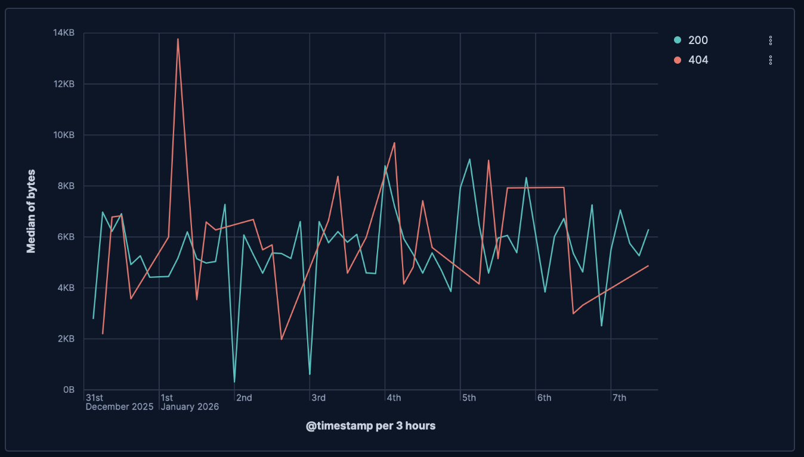
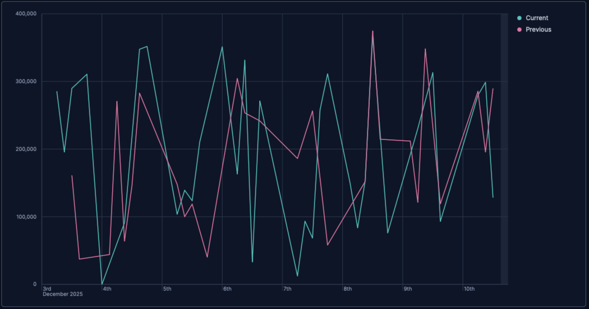
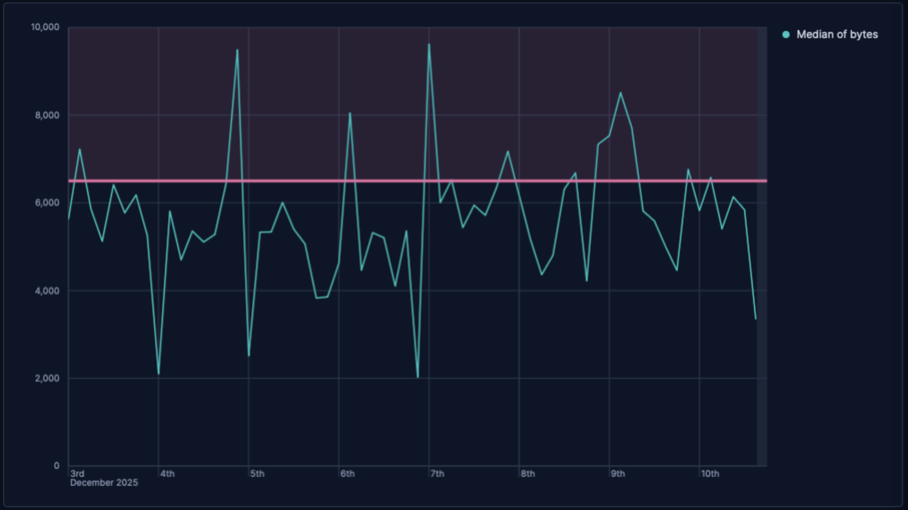
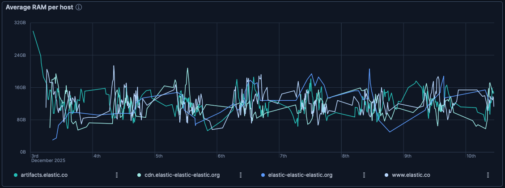
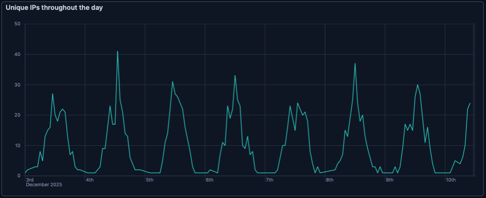

# Build line charts with {{kib}}

Line charts are ideal for visualizing how metrics evolve over time, spotting seasonal patterns, and detecting spikes or regressions at a glance. Use them for KPIs like response time, error rate, throughput, or utilization, and compare multiple series or previous periods on the same chart. You can create line charts from any numeric data using aggregations (for example, `Average`, `Percentile`, `Counter rate`) or with custom [formulas](../lens.md#lens-formulas).

You can create line charts in {{kib}} using [**Lens**](../lens.md).

## Build a line chart

To build a line chart:

::::::{stepper}

:::::{step} Access Lens
**Lens** is {{kib}}'s main visualization editor. You can access it:
- From a dashboard: On the **Dashboards** page, open or create the dashboard where you want to add a line chart, then add a new visualization.
- From the **Visualize library** page by creating a new visualization.
:::::

:::::{step} Set the visualization to Line
New visualizations default to **Bar**.

Using the visualization type dropdown, select **Line**.
:::::

:::::{step} Define the data to show
1. Select the {{data-source}} that contains your data.
2. Drag a [time field](elasticsearch://reference/elasticsearch/mapping-reference/date.md) to the **Horizontal axis** and a numeric field to the **Vertical axis**. {{kib}} automatically selects an appropriate aggregation function compatible with the selected field.

Optionally:
   - Add more numeric fields to create additional series, or drag a categorical field to **Break down by** to split the series.
   - You can click the **Add layer** icon {icon}`plus_in_square` to integrate additional visualizations, [annotations](../lens.md#add-annotations), or a [reference line](../lens.md#add-reference-lines).
:::::

:::::{step} Customize the chart to follow best practices
You can tweak the appearance of your chart by adjusting axes, legends, and series styles from the chart settings. Consider the following best practices:

**Use color wisely**
:   Assign colors that match your users' expectations and consider your specific context.

**Provide context**
:   Add a legend and descriptive axis titles, or remove them for obvious axes.

For layout, hierarchy, and color guidance on dashboards, check EUI’s [Dashboard good practices](https://eui.elastic.co/docs/dataviz/dashboard-good-practices/). 
For more chart configuration options, go to the [Line chart settings](#settings) section.
:::::

:::::{step} Save the chart
- If you accessed Lens from a dashboard, select **Save and return** to save the visualization and add it to that dashboard, or select **Save to library** to add the visualization to the Visualize library.
- If you accessed Lens from the Visualize library, select **Save**. The Save menu also lets you add the visualization to a dashboard and the Visualize library.
:::::

::::::

## Advanced line scenarios

### Compare current versus previous period with time shift [line-previous-period]

In line charts, you can enable time shift to compare the current value with a prior time range and identify deltas.

1. Create a line chart with a time-based **Horizontal axis** and your main metric on **Vertical axis**, for example: `bytes`.
2. Duplicate the layer:
    * {applies_to}`serverless: ga` {applies_to}`stack: ga 9.3` Select {icon}`copy` **Duplicate layer** from the visualization editor.
    * {applies_to}`stack: ga 9.0-9.2` Open the {icon}`boxes_vertical` contextual menu of the visualization editor and select {icon}`copy` **Duplicate layer**.
3. From the duplicated layer settings, select the field defined as vertical axis to open its details. Expand its **Advanced** options and set **Time shift** to `1w` or to the time value of your choice.
   Check [Compare differences over time](../lens.md#compare-data-with-time-offsets) for more details.
4. Optionally, customize the appearance of the layer to adjust how it looks on the chart. When you duplicate a layer, {{kib}} automatically assigns a different **Series color** to the new layer. You can for example change this color, or adjust the layer's name and axis position. This name is used for the chart's legend.

::::{tip}
You can also compute the relative change by defining the axis data with a [formula](/explore-analyze/visualize/lens.md#lens-formulas), for example:  
`(average(bytes) - average(bytes, shift='1w')) / average(bytes, shift='1w')`
:::: 

### Highlight thresholds with reference lines [line-reference-lines]

Use reference lines to indicate important thresholds, such as SLOs or alert limits.

1. In the chart settings, add a static value reference line to mark your target or threshold visually.
2. Use the **Text decoration** setting to provide a name, for example, `Target` or `SLO`, choose a color, and optionally a band.

## Line chart settings [settings]

Customize your line chart to display exactly the information you need, formatted the way you want.

### Horizontal axis settings [horizontal-axis-settings]

**Data**
:   
    - **Functions**:
      - **Date histogram**: Group data points into time-based buckets (for example, hourly, daily, weekly). 
      - **Intervals**: Determine the size of the time buckets in your date histogram. You can define the intervals granularity or specify custom ranges.
      - **Filters**: Allow you to segment your data based on specific conditions, creating separate lines for each filter.
      - **Top values**: Create separate lines for the most common values in a field.

**Appearance**
:   **Name**: By default, the chart uses the function or formula as title. It's a best practice to customize this with a meaningful title.

### Vertical axis settings [vertical-axis-settings]

**Data**
:   To represent the metrics or values you want to visualize, you can use quick functions like `Average`, `Count`, `Percentile`, `Counter rate`, or create custom calculations with formulas. Refer to  for examples, or to the {icon}`documentation` **Formula reference** available from Lens.

    :::{include} ../../_snippets/lens-value-advanced-settings.md
    :::

**Appearance**
   - **Name**: Customize the legend label with a descriptive name.
   - **Value format**: Control how numeric values are displayed on the vertical axis of your visualization.
   - **Series color**: Select a palette or specific color per series.
   - **Axis side**: Control where axis labels and tick marks appear.

### Breakdown settings [breakdown-settings]

Breakdown functions segment your data into multiple lines on the same chart, with each line representing a different value of a categorical field. You can specify the following options:

**Data**
:   
    - **Functions**:
      - **Date histogram**: Group data points into time-based buckets (for example, hourly, daily, weekly). 
      - **Intervals**: Determine the size of the time buckets in your date histogram. You can define the intervals granularity or specify custom ranges.
      - **Filters**: Allow you to segment your data based on specific conditions, creating separate lines for each filter.
      - **Top values**: Create separate lines for the most common values in a field.

Depending on the function and type of field that you select, you can specify more advanced settings.

**Appearance**
:   Allow you to customize how your breakdown data is displayed in line charts, including:

    - **Name**: It's a best practice to customize this with a meaningful title.
    - **Value format**: Control how numeric values are displayed in your visualization.
    - **Color mapping**: Determine how colors are assigned to your breakdown series.

### General layout [appearance-options]

When creating or editing a visualization, you can adjust the following settings.

:::{include} ../../_snippets/line-chart-style-settings.md
:::

:::{include} ../../_snippets/line-chart-legend-settings.md
:::

## Line chart examples

**Average RAM per host**
:   Monitoring the average of RAM over time for the first four hosts:

1. Drag `@timestamp` to the **Horizontal axis** and set the following settings: 
   * **Functions**: `Date histogram`
   * **Minimum interval**: `Hour`
2. Drag `machine.ram` to the **Vertical axis** and set the following settings:
   * **Functions**: : `Moving average`
   * **Value format**: `Bytes`
3. In the **Breakdwon** panel, set the following settings:
   * **Functions**: `Top values`
   * **Fields**: `host.keyword`   
   * **Number of values**: `4`
4. Save your chart.

   

**Unique IPs over time**
:   Visualizing unique IP sessions throughout the day:

1. Drag `@timestamp` to the **Horizontal axis** and set the following settings: 
   * **Functions**: `Date histogram`
   * **Minimum interval**: `Hour`
2. Drag `host.keyword` to the **Vertical axis** and set the following settings:
   * **Functions**: : `Unique count`
   * **Value format**: `Bytes (1024)`
   * **Decimals**: `0`
4. Save your chart.

   

---

