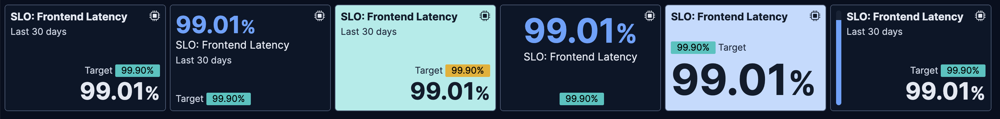
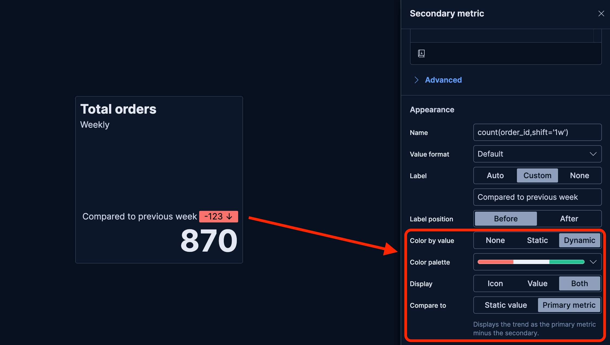
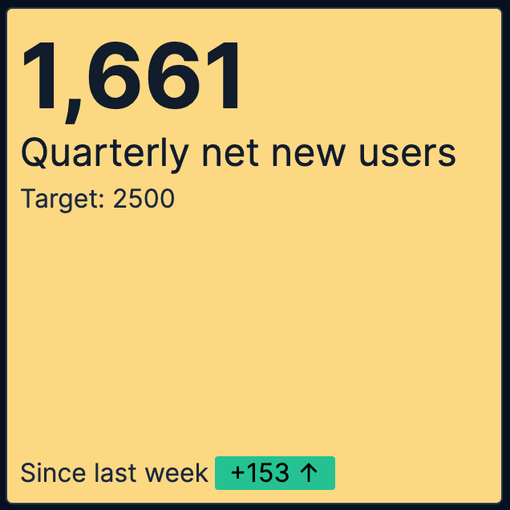
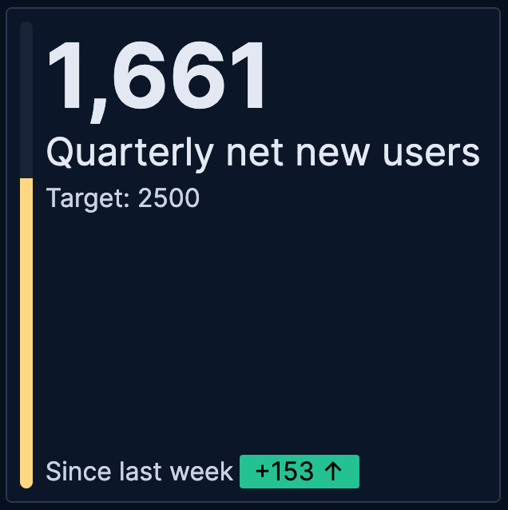
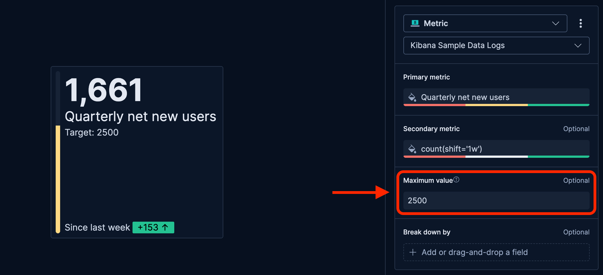
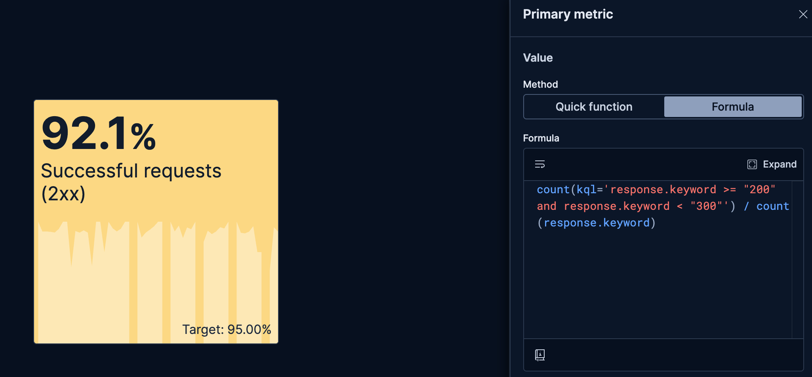
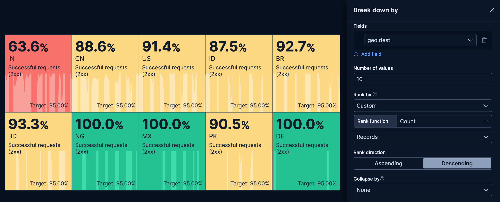
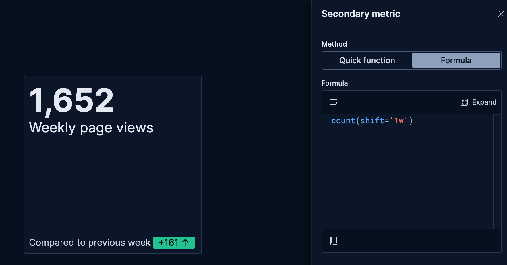

# Build metric charts with {{kib}}

Metric charts make important single values stand out on a dashboard. They're perfect for highlighting KPIs such as error rates or SLOs, and for making them understandable at a glance with dynamic coloring or trend indicators.

They work with any numeric data: plain numbers, percentages, or calculations like a count, sum, or average. You can get this numeric data from numeric fields stored in your {{es}} documents, or from aggregation functions and formulas that you can apply to any type of field. <br>
You can also display strings by using the `Last value` aggregation function that picks up the last document, sorted by timestamp, in the current time frame.


You can create metric charts in {{kib}} using [**Lens**](../lens.md).



## Build a metric chart

To build a metric chart:

:::::{stepper}

::::{step} Access Lens
**Lens** is {{kib}}'s main visualization editor. You can access it:
- From a dashboard: On the **Dashboards** page, open or create the dashboard where you want to add a metric chart, then add a new visualization.
- From the **Visualize library** page by creating a new visualization..
::::

::::{step} Set the visualization to Metric
New visualizations default to creating **Bar** charts. 

Using the dropdown indicating **Bar**, select **Metric**.
::::

::::{step} Define the data to show
1. Select the {{data-source}} that contains your data.
2. Define the **Primary metric** by dragging a field from the fields list to the chart. {{kib}} automatically selects an appropriate aggregation function like Sum, Average, or Count based on the field type. This is the only setting that your metric chart requires to display something.
3. Optionally:
    - Add a [secondary metric](#secondary-metric-options). You can use this secondary metric as a comparison value or as a trend indicator to show how the primary metric evolves over time.
    - Specify a [maximum value](#max-value-options).
    - [Break down](#breakdown-options) the metric into multiple tiles based on another dimension. 

Refer to [](#settings) to find all data configuration options for your metric chart.
::::

::::{step} Customize the chart to follow best practices
Tweak the appearance of the chart to your needs. Consider the following best practices:

**Use color wisely**
:   Assign colors that match your users' expectations and consider your specific context.

**Format for readability**
:   Round to an appropriate precision. Showing 1.2M is clearer than 1,234,567.89 for high-level metrics, but use more precision when small changes matter.

**Provide context**
:   Use titles and subtitles to explain what the metric shows. "45,234" is a number, but "Active Users" as a title gives it meaning, and "Last 24 hours" as a subtitle makes it unambiguous.

Refer to [](#settings) for a complete list of options.
::::

::::{step} Save the chart
- If you accessed Lens from a dashboard, select **Save and return** to save the visualization and add it to that dashboard, or select **Save to library** to add the visualization to the Visualize library and be able to add it to other dashboards later.
- If you accessed Lens from the Visualize library, select **Save**. A menu opens and offers you to add the visualization to a dashboard and to the Visualize library.
::::

:::::

## Advanced metric scenarios

### Show trends in Metric charts [metric-trends]
```{applies_to}
stack: ga 9.1
serverless: ga
```

When creating **Metric** visualizations with numeric data, you can add trend indicators that compare your primary metric to a secondary value. This feature displays colored badges with directional arrows to help you quickly identify whether values are increasing, decreasing, or staying the same.

| Without trend | With trend |
|--------|-------|
|  |  |

To add trend indicators to your metric visualization:

1. Create a **Metric** visualization with a numeric primary metric.
2. Add a secondary metric that represents the comparison value.

    ::::{tip}
    Use the `shift` parameter in formulas to compare current values against historical data. For example, if your primary metric is counting orders (based on an `order_id` field) for the current week, you can use the `count(order_id, shift='1w')` formula to compare this week's count of orders to last week's count.
    ::::

3. In the secondary metric configuration, look for the **Color by value** option. The possible choices are:
   * **None**: No trend indicators (default)
   * **Static**: Shows the secondary metric as a badge with a fixed color that you select
   * **Dynamic**: Enables both color coding and directional icons based on the comparison

4. Select **Dynamic** coloring. More options appear.

   

5. Choose a **Color palette** that matches how you'd like to represent the comparison.

6. Configure the **Display** option:
   * **Icon**: Shows only directional arrows: ↑ for increase, ↓ for decrease, = for no change
   * **Value**: Shows only the secondary metric value
   * **Both**: Shows both the icon and value (default)

7. The secondary metric does not automatically compare with the primary metric. Define the value for **Compare to**:
   * **Static value**: Compares against a fixed baseline value that you specify
   * **Primary metric**: Compares the secondary metric directly against the primary metric by displaying the result of `Primary metric - Secondary metric`. This option is only available when the primary metric is numeric. 
   
     When you select this option, the secondary metric is automatically updated:

       * The secondary metric label changes to **Difference**. You can edit this label.
       * If you chose a **Display** option that shows a value, the secondary metric value is automatically updated to show the difference compared to the primary metric.

8. Apply your changes. 

The metric visualization now shows the secondary metric as a comparison with a trend indicator.

### Show progress by setting a maximum value [metric-progress]

When creating **Metric** visualizations with numeric data, you can specify a maximum value to show progress toward a goal or capacity limit. When combined with the **Bar** supporting visualization option, this displays a progress bar that visually represents how close your current metric is to reaching the maximum value.

| Without progress | With progress |
|--------|-------|
|  |  |

To add a progress bar to your metric visualization:

1. Create a **Metric** visualization with a numeric primary metric.

2. Optionally, [customize the appearance of the metric](#primary-metric-options). For example, add dynamic coloring to the primary metric to change colors based on progress: red when below 50%, yellow between 50-80%, and green above 80%. The progress bar will reflect this configuration once you set up a maximum value.

3. Add a maximum value that represents your goal or upper limit. The [maximum value](#max-value-options) can be a static value, a function, or a formula based on your data.

   

4. Configure the **Primary metric** appearance to show the progress bar. Depending on the configuration of the primary metric, Lens might automatically set this option for you. If not, complete these steps:
   1. In the primary metric configuration, find the **Supporting visualization** option.
   2. Set **Type** to **Bar**.
   3. Optionally, change the orientation of the progress bar as needed.

5. Apply your changes.

The metric visualization now shows a progress bar indicating how close the current value is to the maximum.

::::{tip}
You can combine progress bars with secondary metrics to show both progress toward a goal and trends over time. To do this, add both a maximum value and a secondary metric to your visualization.
::::

## Metric chart settings [settings]

Customize your metric chart to display exactly the information you need, formatted the way you want.

### Primary metric settings [primary-metric-options]

**Value**
:   The main numeric value that appears prominently in your chart. When you drag a field onto the chart, {{kib}} suggests a function based on the field type. You can change it and use aggregation functions like `Sum`, `Average`, `Count`, `Median`, and more, or create custom calculations with formulas. Refer to [](/explore-analyze/visualize/lens.md#lens-formulas) for examples, or to the {icon}`documentation` **Formula reference** available from Lens.

    :::{include} ../../_snippets/lens-value-advanced-settings.md
    :::

**Appearance**
:   Define the formatting of the primary metric, including:
    - **Name**: By default, the chart uses the function or formula as title. It's a best practice to customize this with a meaningful title.
    - **Value format**: Choose to display the metric as number, percent, bytes, bits, duration, or with a custom format that you can define.
    - **Color by value**: Apply colors to the chart. Choose between **Static** for a unique color and **Dynamic** for using different colors based on the metric's value. By default, the color applies to the chart's background. 
      - **Static**: Pick a color and its opacity. That color always remains the same and is independent from the metric's value.
      - **Dynamic**: Define colors to apply to the chart based on the value of the primary metric.
    - **Supporting visualization**: Display a visualization as background or on the side of the metric.
      - **Type**: Select **Panel** for a unified background, **Line** for showing a light line chart in the background, or **Bar** for showing a progress bar that represents the current value of the chart measured against the [Maximum value](#max-value-options) defined for the chart.
      - **Apply color to**: This option is available when you have selected **Panel** as supporting visualization type. Choose to apply the color defined to the background, or to the primary metric's value.
    - **Icon decoration**: Add an icon to the top right corner of the chart.

### Secondary metric settings [secondary-metric-options]

**Value**
:   An optional additional value that provides context or enables comparisons. Common uses include:
    * Time-shifted values to show trends (for example, last week's sales compared to this week)
    * Different aggregations on the same data (for example, showing both average and median response times)
    * Related metrics for context (for example, showing total count alongside an average)

    :::{include} ../../_snippets/lens-value-advanced-settings.md
    :::

**Appearance**
:   Define the formatting of the secondary metric, including:
    - **Name**: By default, the chart uses the function or formula as title. It's a best practice to customize this with a meaningful title.
    - **Value format**: Choose to display the metric as number, percent, bytes, bits, duration, or with a custom format that you can define.
    - **Label**: Define the label displayed next to the secondary metric. By default, the **Name** shows. You can instead show a **Custom** value or hide it by selecting **None**.
    - **Label position**: Choose to show the label **Before** or **After** the metric.
    - **Color by value**: Apply colors to the chart. Choose between **None**, **Static** for a unique color and **Dynamic** for using different colors based on the metric's value. This option allows you to use the secondary metric as a comparison point to highlight trends. Refer to [](#metric-trends) for more details.

### Maximum value settings [max-value-options]

**Value**
:   An optional reference value that defines the upper bound for your metric. Specifying a maximum lets you show a progress bar in your metric chart. The progress is represented by your primary metric's value on a scale of 0 to the defined maximum value. This option is useful for showing progress toward goals or capacity limits.

    :::{note}
    If a progress bar doesn't show after setting a maximum value, manually set the primary metric's **Supporting visualization** option to **Bar**.
    :::

    :::{include} ../../_snippets/lens-value-advanced-settings.md
    :::

**Appearance**
:   Define the formatting of the maximum value, including:
    - **Name**: It's a best practice to customize this with a readable title.

### Breakdown settings [breakdown-options]

**Data**
:   Split your metric into multiple tiles based on a categorical field. Each unique value creates its own tile, allowing you to compare metrics across regions, products, time periods, or any other dimensions. You can optionally specify the following options:

    - **Number of values**: The number of tiles to show. If more values are available for the selected breakdown field, an additional tile named **Other** shows if the **Group remaining values as "Other"** advanced option is on.
    - **Rank by**: The dimension by which top values are ranked.
    - **Rank direction**: The direction to use for the ranking.
    - **Collapse by**: Aggregate values of the various tiles into a single number. Possible aggregation options are `None` (default), `Sum`, `Average`, `Min`, and `Max`.

    :::{include} ../../_snippets/lens-breakdown-advanced-settings.md
    :::

**Appearance**
:   Define the formatting of the broken down view of the metric, including:
    - **Name**: It's a best practice to customize this with a meaningful title.
    - **Layout columns**: The number of columns used to lay out the various tiles of your metric chart.


### General layout settings [appearance-options]
```{applies_to}
stack: ga 9.2
```
When creating or editing a visualization, you can customize several appearance options. To do that, look for the {icon}`brush` icon.

**Primary metric**
:   Define the formatting of the primary metric in terms of **Position**, **Alignment**, and **Font size**.

**Title and subtitle**
:   Enter a subtitle and define the relevant **Alignment** and **Font weight**.

**Secondary metric**
:   Define the **Alignment** of the secondary metric.

**Other**
:   Choose the **Icon** position.


## Metric chart examples

The following examples show various configuration options that you can use for building impactful metrics.

**Ratio of successful requests**
:   Display the percentage of successful requests on a monitoring dashboard:

    * **Title**: "Successful requests (2xx)"
    * **Primary metric**: `count(kql='response.code >= "200" and response.code < "300"') / count(response.code)`
      * **Value format**: `Percent`
      * **Color by value**: `Dynamic` (green when above 95%, yellow between 75% and 95%, red when below)
      * **Supporting visualization:** "Line" to show evolution over time
    * **Secondary metric**: `0.95` formula
      * **Value format**: `Percent`
      * **Label**: Custom, set to `Target:`

    

**Ratio of successful requests per origin**
:   This example builds on the previous one to display the percentage of successful requests for the 10 countries with the most incoming requests on a monitoring dashboard:

    * **Title**: "Successful requests (2xx)"
    * **Primary metric**: `count(kql='response.code >= 200 and response.code < 300') / count(response.code)`
      * **Value format**: `Percent`
      * **Color by value**: `Dynamic`. Green when above 95%, yellow between 75% and 95%, red when below
      * **Supporting visualization:** "Line" to show evolution over time
    * **Secondary metric**: `0.95` formula
      * **Name**: `Target:`
      * **Value format**: `Percent`
    * **Break down by**: `geo.dest`
      * **Number of values**: `10`
      * **Rank by**: `Custom` > `Count` > `Records` to get countries generating most requests 

    

**Website traffic with trend**
:   Monitor current traffic and show whether it's increasing or decreasing compared to the previous period:

    * **Title**: "Weekly page views"
    * **Primary metric**: `count()` (current week's page views)
    * **Secondary metric**: `count(shift='1w')` (previous week's page views)
      * **Color by value**: Dynamic coloring
      * **Compare to**: Primary metric
      * **Display**: Both icon and value
      * **Label**: "Compared to previous week"
      * **Color palette**: Green for increases (more traffic is positive)

    