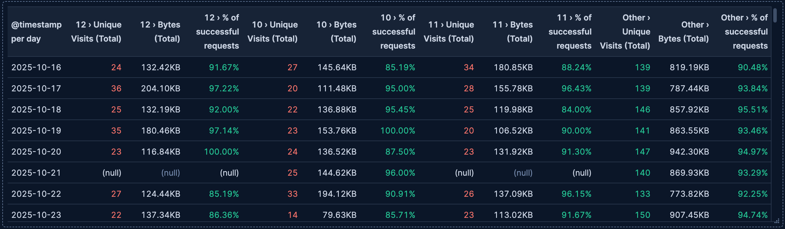

# Build tables with {{kib}}

Tables are versatile visualizations that display your data in rows and columns, making them ideal for detailed data analysis and comparison. They're perfect for displaying multiple metrics side-by-side, showing individual records, or creating pivot tables that summarize data across different dimensions.

Tables work with any type of data: numeric values, strings, dates, and more. You can organize data using rows, add metrics to analyze, and optionally split metrics into separate columns to create pivot-style views. Tables offer extensive customization options including sorting, filtering, formatting, and coloring.

You can create tables in {{kib}} using [**Lens**](../lens.md).

## Build a table

To build a table:

:::::{stepper}

::::{step} Access Lens
**Lens** is {{kib}}'s main visualization editor. You can access it:
- From a dashboard: On the **Dashboards** page, open or create the dashboard where you want to add a table, then add a new visualization.
- From the **Visualize library** page by creating a new visualization.
::::

::::{step} Set the visualization to Table
New visualizations default to creating **Bar** charts. 

Using the dropdown indicating **Bar**, select **Table**.
::::

::::{step} Define the data to show
1. Select the {{data-source}} that contains your data.
2. Define your table structure by dragging fields and defining functions for one or more of these dimensions:
    - **Metrics**: The values to display in columns. You can use aggregation functions like `Sum`, `Average`, and `Count`, or create custom calculations with formulas.
    - **Rows** (optional): Fields that create the rows of your table. Each unique value becomes a row. You can use functions like **Top values**, **Date histogram**, **Intervals**, or **Filters** to organize your rows. You can add multiple fields as rows to create hierarchical groupings and break down the data more granularly.
    - **Split metrics by** (optional): Break metrics into separate columns based on a categorical field, creating a pivot table view.
3. Optionally, customize individual columns by clicking on any dimension in the layer pane to configure formatting, alignment, coloring, and more.

Refer to  to find all configuration options for your table.
::::

::::{step} Customize the table to follow best practices
Tweak the appearance of the table to your needs. Consider the following best practices:

**Make it scannable**
:   Use consistent formatting and alignment. For example, you can right-align numbers for easier comparison, and left-align text for readability.

**Use color purposefully**
:   Apply color to values or cells to highlight important data or patterns. Avoid using too many colors that might distract from the data.

**Add context with summary rows**
:   Use summary rows to show totals, averages, or other aggregate values that help users understand the overall picture.

**Enable interactivity**
:   Turn on **Directly filter on click** to let users click on values to filter the dashboard or drill down into data.

**Control density**
:   Adjust table density based on your use case. Use **Compact** for fitting more rows, **Expanded** for better readability.

Refer to  for a complete list of options.
::::

::::{step} Save the table
- If you accessed Lens from a dashboard, select **Save and return** to save the visualization and add it to that dashboard, or select **Save to library** to add the visualization to the Visualize library and be able to add it to other dashboards later.
- If you accessed Lens from the Visualize library, select **Save**. A menu opens and offers you to add the visualization to a dashboard and to the Visualize library.
::::

:::::

## Advanced table scenarios

### Create pivot tables

Tables can display data in a pivot-style format by using the **Split metrics by** dimension. This creates separate columns for each unique value of the split field, which is great for comparing metrics across different categories.

To create a pivot table:

1. Create a **Table** visualization.
2. Add a dimension to **Rows**.
3. Add one or more metrics.
4. Drag a categorical field to **Split metrics by** to create separate columns for each unique value.

For example, you could show visits per date in rows, split by the top 3 hours of the day with most traffic, and add various metrics such as the number of visits or the percentage of successful requests. This creates a pivot table showing the various metrics for each hour of the day with the most traffic.

Refer to [Analyze the data in a table](../../dashboards/create-dashboard-of-panels-with-ecommerce-data.md#view-customers-over-time-by-continents) for a detailed example.

### Use formulas in tables

Tables support Lens formulas, which let you create calculated columns with custom logic. You can use formulas to:

* Calculate percentages or ratios between metrics
* Compare current values to time-shifted values
* Apply mathematical operations across multiple fields
* Create conditional calculations

To add a formula to a table:

1. In the **Metrics** dimension, select **Add a field**.
2. Select **Formula** from the function list.
3. Enter your formula using the available functions and fields.
4. Customize the column name and formatting.

Refer to  for formula examples, including time-shifting comparisons and mathematical operations, and the {icon}`documentation` **Formula reference** available from Lens.

## Table settings [settings]

Customize your table to display exactly the information you need, formatted the way you want.

### Metrics settings [metrics-options]

**Value**
:   The metrics to display in your table columns. When you drag a field onto the table, {{kib}} suggests a function based on the field type. You can change it and use aggregation functions like `Sum`, `Average`, `Count`, `Median`, and more, or create custom calculations with formulas. 

    Each metric becomes its own column in the table. If you use [**Split metrics by**](#columns-options), each metric is further split into multiple columns.

    Refer to  for examples, or to the {icon}`documentation` **Formula reference** available from Lens.

    :::{include} ../../_snippets/lens-value-advanced-settings.md
    :::

**Appearance**
:   Define the formatting and behavior of each metric column, including:
    
    - **Name**: The column header label. By default, the chart uses the function or formula name. It's a best practice to customize this with a meaningful title.
    
    :::{include} ../../_snippets/lens-tables-column-appearance-settings.md
    :::
    
    - **Summary row**: Add a row at the bottom of the table showing an aggregate value for this column. You can choose the aggregation function (`Sum`, `Average`, `Min`, `Max`, `Count`) and customize the **Summary label**.

### Rows settings [rows-options]

**Data**
:   Define which fields create the rows of your table. Drag a field to the **Rows** dimension, and {{kib}} suggests an appropriate function based on the field type. 

    - **Functions**:
      - **Top values**: Show the most common values of a categorical field. Configure the number of values to display, ranking criteria, and sort direction.
        - **Number of values**: How many top values to display
        - **Rank by**: Which metric to use for ranking
        - **Rank direction**: Ascending or descending order
        :::{include} ../../_snippets/lens-breakdown-advanced-settings.md
        :::
      - **Date histogram**: Group data by time intervals. Configure the time interval and how to handle date formatting.
        :::{include} ../../_snippets/lens-histogram-settings.md
        :::
      - **Intervals**: Create numeric ranges for continuous data. Useful for grouping numeric fields into buckets. You can define the interval granularity or specify custom ranges.
        :::{dropdown} How does interval granularity work?
        Interval granularity divides the field into evenly spaced intervals based on the minimum and maximum values for the field.
        
        The size of the interval is a "nice" value. When the granularity of the slider changes, the interval stays the same when the “nice” interval is the same. The minimum granularity is 1, and the maximum value is histogram:maxBars. To change the maximum granularity, go to Advanced settings.
        
        Intervals are incremented by 10, 5 or 2. For example, an interval can be `100` or `0.2`.
        :::
      - **Filters**: Define custom KQL filters to create specific row groups. Each filter creates one row in the table.

    - **Collapse by**: Aggregate rows that share the same value for this field into a single row, combining their metrics (for example, sum or average for each group). This is useful when you want to display a consolidated result for grouped values instead of individual rows.

    

**Appearance**
:   - **Name**: Customize the column header label for the row dimension.
    :::{include} ../../_snippets/lens-tables-column-appearance-settings.md
    :::
    - **Directly filter on click**: Make the values in this column clickable, so clicking a value adds a filter to your visualization or dashboard for that value. This interactivity is helpful for quickly drilling down into data.

### Split metrics by settings [columns-options]

**Data**
:   Optionally split your metrics into separate columns based on a categorical field. This creates a pivot table view where each unique value of the split field becomes its own column. This is useful for comparing the same metric across different categories side by side.

    - **Functions**:
      - **Top values**: Show the most common values of a categorical field. Configure the number of values to display, ranking criteria, and sort direction.
        - **Number of values**: How many top values to display
        - **Rank by**: Which metric to use for ranking
        - **Rank direction**: Ascending or descending order
        :::{include} ../../_snippets/lens-breakdown-advanced-settings.md
        :::
      - **Date histogram**: Group data by time intervals. Configure the time interval and how to handle date formatting.
        :::{include} ../../_snippets/lens-histogram-settings.md
        :::
      - **Intervals**: Create numeric ranges for continuous data. Useful for grouping numeric fields into buckets. You can define the interval granularity or specify custom ranges.
        :::{dropdown} How does interval granularity work?
        Interval granularity divides the field into evenly spaced intervals based on the minimum and maximum values for the field.
        
        The size of the interval is a "nice" value. When the granularity of the slider changes, the interval stays the same when the “nice” interval is the same. The minimum granularity is 1, and the maximum value is histogram:maxBars. To change the maximum granularity, go to Advanced settings.
        
        Intervals are incremented by 10, 5 or 2. For example, an interval can be `100` or `0.2`.
        :::
      - **Filters**: Define custom KQL filters to create specific column groups. Each filter creates one column in the table. 

**Appearance**
:   - **Name**: Customize the split dimension. This name is not used on the table.

### General table settings [appearance-options]

When creating or editing a table visualization, you can customize several appearance options. To do that, look for the {icon}`brush` icon.

**Density** {applies_to}`stack: ga 9.1` {applies_to}`serverless: ga`
:   Control how much space each row occupies. Choose between:
    - **Compact**: Minimal spacing, fits more rows in less space
    - **Normal**: Balanced spacing (default)
    - **Expanded**: More generous spacing for improved readability

**Max header cell lines**
:   Set the maximum number of lines that column headers can span. When header text is longer than this setting, it is truncated with an ellipsis. Use `Auto` to let {{kib}} determine the appropriate height, or set a specific number like `1`, `2`, or `3`.

**Body cell lines**
:   Set the number of lines that body cells display. When cell content exceeds this limit, it is truncated with an ellipsis. Use `Auto` to automatically adjust based on content, or set a specific number like `1`, `2`, or `3` for consistent row heights. Setting this to `1` creates more compact tables, while higher values allow more content to be visible.

**Paginate table**
:   Toggle pagination on or off. When enabled:
    - The table displays a limited number of rows per page.
    - Navigation controls appear at the bottom of the table when the table contains at least 10 items. By default, 10 rows appear per page. Users of the dashboard will be able to select a different number.
    - This is helpful for tables with many rows to improve performance and readability.
    
    When disabled, all rows appear in a scrollable view (up to the maximum returned by the query).

## Table examples

The following examples show various configuration options you can use for building effective tables.

**Top pages by unique visitors**
:   Display the most visited pages on your website with the number of unique visitors:

    * **Rows**: `request.keyword` field using **Top values** function
      * **Number of values**: `5`
    * **Metrics**: `clientip` field using **Unique count** function
      * **Value format**: `Number`
      * **Text alignment**: `Right`

    

**Sales by date and continent (pivot table)**
:   Create a pivot table showing customer counts across different continents over time:

    * **Rows**: `order_date` field using **Date histogram** function
      * **Minimum interval**: `1d`
      * **Name**: `Sales per day`
    * **Metrics**: `customer_id` field using **Unique count** function
    * **Split metrics by**: `geoip.continent_name` field using **Top values** set to `3`

    

**Document comparison with custom ranges**
:   Compare metrics across custom-defined ranges:

    * **Rows**: `bytes` field using **Intervals** function
      * **Ranges**: 
        * `0` → `10240`, labeled `Below 10KB`
        * `10240` → `+∞`, labeled `Above 10KB`
      * **Name**: `File size`
    * **Metrics**: `bytes` field using **Sum** function
      * **Name**: `Total bytes transferred`
      * **Value format**: `Bytes`
      * **Text alignment**: `Right`
    * **Additional styling**: 
      * **Color by value**: Dynamic coloring to highlight ranges with higher byte transfers

**Weekly sales with percentage change**
:   Show week-over-week sales trends with calculated percentage changes:

    * **Rows**: `order_date` field using **Date histogram** function
      * **Minimum interval**: `1w`
      * **Name**: `Week`
    * **Metrics** (two columns):
      1. `Records` using **Count** function
         * **Name**: `Orders this week`
      2. **Formula**: `count() / count(shift='1w') - 1`
         * **Name**: `Change from last week`
         * **Value format**: `Percent`, 2 decimals
         * **Color by value**: Dynamic (green for positive growth, red for negative)
         * **Text alignment**: `Right`