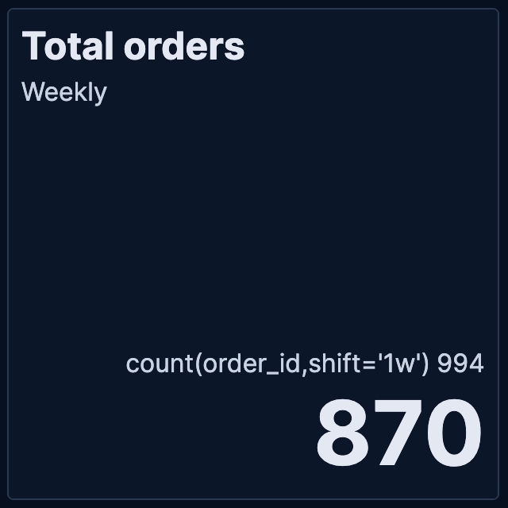
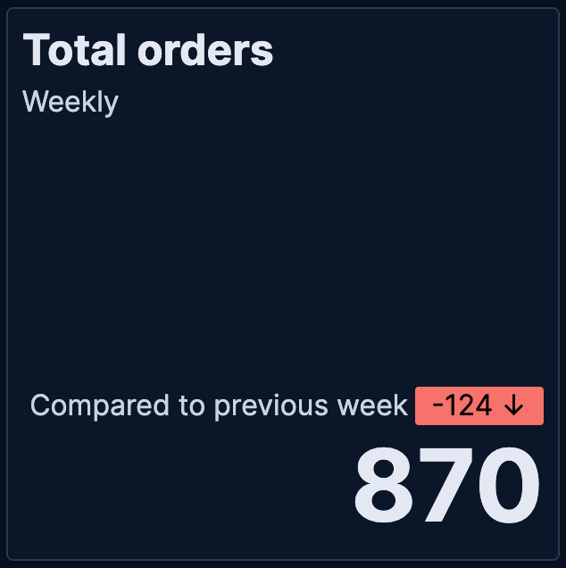

# Lens [lens]

**Lens** is {{kib}}'s drag-and-drop visualization builder. It lets you create charts without writing queries: You drag fields onto the canvas, and {{kib}} suggests the best visualization types for your data.

These fields come from your data indices stored in {{es}}. When you bring data into {{es}}, like logs, metrics, or business data, each piece of information becomes a field: timestamps, user names, error codes, sales amounts, and so on.

Lens doesn't directly look into your {{es}} indices. You first need to specify a [data view](/explore-analyze/find-and-organize/data-views.md) that tells {{kib}} which indices to look at. When you open Lens and select a data view, you see all the fields from that data as a list you can drag and drop to build visualizations.

:::{tip}
If you collected data using one of the {{kib}} [ingest options](/manage-data/ingest.md), uploaded a file, or added sample data, you likely have a {{data-source}} created automatically, and can start exploring your data. If not, you must create one yourself.
:::

With **Lens**, you can:

* Create area, line, and bar charts with layers to display multiple indices and chart types.
* Change the aggregation function to change the data in the visualization.
* Create custom tables.
* Perform math on aggregations using **Formula**.
* Use time shifts to compare the data in two time intervals, such as month over month.
* Add annotations and reference lines.


## Create visualizations [create-the-visualization-panel]

If you’re unsure about the visualization type you want to use, or how you want to display the data, drag the fields you want to visualize onto the workspace, then let **Lens** choose for you.

If you already know the visualization type you want to use, and how you want to display the data, use the following process.

Choose the visualization type.

1. Before you drag fields to the workspace, open the **Visualization type** dropdown, then select the visualization you want to use.
2. To view more visualizations that **Lens** automatically created for the fields, click **Suggestions**. If one of the **Suggestions** meets your visualization needs, click **Save and return** to add it to the dashboard.

Choose the data you want to visualize.

1. Drag the fields directly to the layer pane. **Lens** automatically selects the aggregation function.
2. If you want to learn more about the data a field contains, click the field.
3. To visualize more than one {{data-source}}, select {icon}`plus_in_square` **Add layer**, choose the layer type, then select the {{data-source}}.

Edit and delete.

1. Hover over the panel and click  to edit the visualization. The **Edit visualization** flyout appears.
2. To change the aggregation **Quick function**, click the field in the flyout.
3. To delete a field, click  next to the field.
4. To duplicate a layer, click  in the flyout, then select **Duplicate layer**.
5. To clear the layer configuration, click  in the flyout, then select **Clear layer**.
6. Click **Apply and close**.

::::{tip}
Use the **Edit visualization** flyout to make edits without having to leave the dashboard, or click **Edit in Lens** in the flyout to make edits using the Lens application.
::::


### Change the fields list [change-the-fields]

Change the fields list to display a different {{data-source}}, different time range, or add your own fields.

* To create a visualization with fields in a different {{data-source}}, open the {{data-source}} dropdown, then select the {{data-source}}.

    For more information about {{data-sources}}, refer to [Create a {{data-source}}](../find-and-organize/data-views.md).

* If the fields list is empty, change the [time filter](../query-filter/filtering.md).
* To add fields, open the {{data-source}} dropdown, then select **Add a field to this {{data-source}}**.
  
  
  For more information about adding fields to {{data-sources}} and examples, refer to [Explore your data with runtime fields](../find-and-organize/data-views.md#runtime-fields).


### Create custom tables [create-custom-tables]

Tables are highly customizable, and provide you with text alignment, value formatting, coloring options, and more.

1. From the **Visualization type** dropdown, select **Table**.
2. Drag the fields you want to visualize to the workspace.
3. To sort or hide the columns, click the arrow next to the column heading, then select an option.

    All columns that belong to the same layer pane group are sorted in the table.

4. To change the display options, click a **Metrics** field in the layer pane, then configure the following options:

    * **Name** — Specifies the field display name.
    * **Collapse by** — Aggregates all metric values with the same value into a single number.
    * **Value format** — Specifies how the field value displays in the table.
    * **Text alignment** — Aligns the values in the cell to the **Left**, **Center**, or **Right**.
    * **Color by value** — Applies color to the cell or text values. To change the color, click the **Edit colors** icon.
    * **Hide column** — Hides the column for the field.
    * **Directly filter on click** — Turns column values into clickable links that allow you to filter or drill down into the data.
    * **Summary row** — Adds a row that displays the summary value. When specified, allows you to enter a **Summary label**.


### Assign colors to terms [assign-colors-to-terms]
```{applies_to}
stack: preview 9.0, ga 9.1
serverless: ga
```

You can assign specific colors to terms in your visualizations. This color mapping can be useful in several situations:

* **Visual recognition and recall**: Keep colors consistent for each term regardless of filters or sorting.
* **Semantic meaning**: Use colors to convey meaning or categorization.
* **Consistency**: Align with brand colors and improve overall aesthetic consistency.


#### Supported visualization types

Color mapping is available for the following **Lens** visualization types:

* **Data tables**: Assign colors to terms in **Rows** or **Metrics** fields. You can apply colors to cell backgrounds or text.
* **XY charts (Area, Bar, Line)**: Assign colors to breakdown dimensions that split your data into multiple series.
* **Partition charts (Donut, Pie, Treemap, Waffle)**: Assign colors to the main slice or group-by dimension that defines the chart segments.
* **Tag clouds**: Assign colors to the tags dimension that determines the terms displayed in the cloud.

#### Configure color mapping in a chart

To assign colors to terms in your visualization:

1. Create a visualization using one of the supported types.
2. Add a categorical field that contains the terms you want to color.
3. In the field configuration, look for the **Color by value** option:
   * For data tables: Select **Cell** or **Text**
   * For other chart types: This option appears when you have a categorical breakdown
4. Click the **Edit colors** icon. In the menu that opens, keep **Use legacy palettes** turned off to be able to assign colors to specific terms
5. Select a color palette from the available options:
   * **Elastic**: The default and most recent palette. It is intentionally built from a color spectrum designed for flexibility and consistency, while being suited for future accessibility improvements.
   * **{{kib}} 7.0**: A palette that matches the {{kib}} 7.0 color theme for visualizations
   * **{{kib}} 4.0**: A palette that matches the {{kib}} 4.0 color theme for visualizations
   * **Elastic classic**: A palette made of classic Elastic brand colors
6. Select the color mode you'd like to use with this palette:
   * **Categorical**: Assign a distinct color to each term
   * **Gradient**: Assign gradients of the same color to each term
7. Choose which terms to color. You can assign colors manually or select **Add all unassigned terms** for automatic assignment.
   :::{tip}
   You can assign several terms to the same color.
   :::
8. Choose how to handle unassigned terms: Use the selected color palette or assign a single color.


#### Color options and accessibility

**Discrete colors and gradients**

Choose from discrete color sets or generate sequential or divergent gradients. Gradients work well for Likert scales and other term scales.

**Theme-aware neutral colors**

Use neutral gray colors that adjust automatically between light and dark themes. These help de-emphasize less important data.

**Accessibility warnings**

The system warns you when colors don't have enough contrast for accessibility.

#### Best practices

**Maintain consistency**

Use color mapping to create consistent color schemes when the same categorical data appears across multiple visualizations in your dashboards.

**Use semantic colors**

Leverage color associations that users already understand (such as red for errors, green for success) to make your visualizations more intuitive.

**Consider performance**

Color mapping works best with fields that have a reasonable number of distinct values. Fields with hundreds or thousands of unique terms may impact visualization performance.

**Plan for themes**

When choosing colors, consider how they will appear in both light and dark themes. Use theme-aware neutral colors when you want to de-emphasize data.

### Show trends in Metric charts [metric-trends]
```{applies_to}
stack: ga 9.1
serverless: ga
```

When creating **Metric** visualizations with numeric data, you can add trend indicators that compare your primary metric to a secondary value. This feature displays colored badges with directional arrows to help you quickly identify whether values are increasing, decreasing, or staying the same.

| Without trend | With trend |
|--------|-------|
|  |  |

To add trend indicators to your metric visualization:

1. Create a **Metric** visualization with a numeric primary metric.
2. Add a secondary metric that represents the comparison value.

    ::::{tip}
    Use the `shift` parameter in formulas to compare current values against historical data. For example, if your primary metric is counting orders (based on an `order_id` field) for the current week, you can use the `count(order_id, shift='1w')` formula to compare this week's count of orders to last week's count.
    ::::

3. In the secondary metric configuration, look for the **Color by value** option. The possible choices are:
   * **None** — No trend indicators (default)
   * **Static** — Shows the secondary metric as a badge with a single color that you select
   * **Dynamic** — Enables both color coding and directional icons based on the comparison

4. Select **Dynamic** coloring. More options appear.

5. Choose a **Color palette** that matches how you'd like to represent the comparison.

6. Configure the **Display** option:
   * **Icon** — Shows only directional arrows: ↑ for increase, ↓ for decrease, = for no change
   * **Value** — Shows only the secondary metric value
   * **Both** — Shows both the icon and value (default)

7. The secondary metric does not automatically compare with the primary metric. Define the value to **Compare to**:
   * **Static value** — Compares against a fixed baseline value that you specify
   * **Primary metric** — Compares the secondary metric directly against the primary metric. This option is only available when the primary metric is numeric. 
   
     When you select this option, the secondary metric is automatically updated:

       * The secondary metric label changes to **Difference**. You can change this by editing the **Prefix** option of the metric.
       * If you chose a **Display** option that shows a value, the secondary metric value is automatically updated to show the difference compared to the primary metric.

7. Apply your changes. 

The metric visualization is updated and now shows the secondary metric as a comparison with a trend indicator.


### Create visualizations with keyboard navigation [drag-and-drop-keyboard-navigation]

To use a keyboard instead of a mouse, use the **Lens** fully accessible and continuously improved drag system.

1. Select the field in the fields list or layer pane. Most fields have an inner and outer select state. The inner state opens a panel with detailed information or options. The outer state allows you to drag the field. Tab through the fields until you get the outer state on the field.

   :::{image} /explore-analyze/images/kibana-lens_drag_drop_2.png
   :alt: Lens drag and drop focus state
   :screenshot:
   :::

2. Complete the following actions:

    * To select a field, press Space bar.
    * To select where you want to drop the field, use the Left and Right arrows.
    * To reorder the fields on the layer pane, use the Up and Down arrows.
    * To duplicate an action, use the Left and Right arrows, then select the **Drop a field or click to add** field you want to use.

      :::{image} /explore-analyze/images/kibana-lens_drag_drop_3.gif
      :alt: Using drag and drop to reorder
      :screenshot:
      :::

3. To confirm the action, press Space bar. To cancel, press Esc.


### Use formulas to perform math [lens-formulas]

When you're defining the fields and data to show in a visualization, formulas allow you to perform math on aggregated data. For example, you can use formulas to divide two values and produce a percent value.

1. Add a field to your visualization and select it to open its data and appearance settings.
2. Select **Formula**, then enter the formula.

    Filter ratio example
    :   To filter a document set, use `kql=''`, then compare to other documents within the same grouping:

        ```
        count(kql='response.status_code > 400') / count()
        ```


    Week over week example
    :   To get the value for each grouping from the previous week, use `shift='1w'`.

        ```
        percentile(system.network.in.bytes, percentile=99) /
        percentile(system.network.in.bytes, percentile=99, shift='1w')
        ```

        You are unable to combine different time shifts, such as `count(shift="1w") - count()` and `count(shift="1w") - count(shift="1m")`, with the **Top values** function.


    Percent of total example
    :   To convert each grouping into a percent of the total, formulas calculate `overall_sum` for all groupings:

        ```
        sum(products.base_price) / overall_sum(sum(products.base_price))
        ```

        ::::{tip}
        For detailed information on formulas, click .
        ::::

3. To accurately display the formula, select **Percent** from the **Value format** dropdown.


### Compare differences over time [compare-data-with-time-offsets]

Compare your real-time data to the results that are offset by a time increment. For example, you can compare the real-time percentage of a user CPU time spent to the results offset by one hour.

1. In the layer pane, click the field you want to offset.
2. Click **Advanced**.
3. In the **Time shift** field, enter the time offset increment.

For a time shift example, refer to [Compare time ranges](../dashboards/create-dashboard-of-panels-with-ecommerce-data.md#compare-time-ranges).


### Create partition charts with multiple metrics [create-partition-charts-with-multiple-metrics]

To create partition charts, such as pie charts, configure one or more **Slice by** dimensions to define the partitions, and a **Metric** dimension to define the size. To create partition charts with multiple metrics, use the layer settings. Multiple metrics are unsupported for mosaic visualizations.

1. In the layer pane, click , then select **Layer settings**.
2. Select **Multiple metrics**.
3. Click **X**.


### Improve visualization loading time [improve-visualization-loading-time]

::::{warning}
This functionality is in technical preview and may be changed or removed in a future release. Elastic will work to fix any issues, but features in technical preview are not subject to the support SLA of official GA features.
::::


Data sampling allows you to improve the visualization loading time. To decrease the loading time, use a lower sampling percentage, which also decreases the accuracy. Use low sampling percentages on large datasets.

1. In the **Edit visualization** flyout, click , then select **Layer settings**.
2. To select the **Sampling** percentage, use the slider.
3. Click **Apply and close**.
4. Click **Save**.


### Add annotations [add-annotations]

::::{warning}
This functionality is in technical preview and may be changed or removed in a future release. Elastic will work to fix any issues, but features in technical preview are not subject to the support SLA of official GA features.
::::


Annotations allow you to call out specific points in your visualizations that are important, such as significant changes in the data. You can add annotations for any {{data-source}}, add text and icons, specify the line format and color, and more.

:::{image} /explore-analyze/images/kibana-lens_annotations_8.2.0.png
:alt: Lens annotations
:screenshot:
:::

Annotations support two placement types:

* **Static date** — Displays annotations for specific times or time ranges.
* **Custom query** — Displays annotations based on custom {{es}} queries. For detailed information about queries, check [Semi-structured search](/explore-analyze/query-filter/languages/kql.md#semi-structured-search).

Any annotation layer can be saved as an annotation group to the **Visualize Library** in order to reuse it in other visualizations. Any changes made to the annotation group will be reflected in all visualizations to which it is added.

Create a new annotation layer.

1. From your visualization, select {icon}`plus_in_square` **Add layer > Annotations > New annotation**.
2. Select the {{data-source}} for the annotation.
3. From the fields list, drag a field to the **Add an annotation** field.
4. To use global filters in the annotation, click , then select **Keep global filters** from the dropdown.

    When you add the visualization to dashboards,  appears, which allows you to view settings changes to the visualization.


Create static annotations.

1. Select **Static date**.
2. In the **Annotation date** field, click , then select the date.
3. To display the annotation as a time range, select **Apply as range**, then specify the **From** and **To** dates.

Create custom query annotations.

1. Select **Custom query**.
2. Enter the **Annotation query** for the data you want to display.

    For detailed information about queries and examples, check [Semi-structured search](/explore-analyze/query-filter/languages/kql.md#semi-structured-search).

3. Select the **Target date field**.

Specify the annotation appearance.

1. Enter the annotation **Name**.
2. Change the **Appearance** options for how you want the annotation to display on the visualization.
3. If you created a custom query annotation, click **Add field** to add a field to the annotation tooltip.
4. To close, click **X**.

Save the annotation group to the library.

1. From your visualization, on your annotation layer, click .
2. Enter the **Title**, **Description**, and add any applicable [**Tags**](../find-and-organize/tags.md).
3. Click **Save group**.

Add a library annotation group to a visualization.

1. From your visualization, select {icon}`plus_in_square` **Add layer > Annotations > Load from library**.
2. Select the annotation group you want to use.


### Add reference lines [add-reference-lines]

With reference lines, you can identify specific values in your visualizations with icons, colors, and other display options. You can add reference lines to any visualization type that displays axes.

For example, to track the number of bytes in the 75th percentile, add a shaded **Percentile** reference line to your time series visualization.

:::{image} /explore-analyze/images/kibana-lens_referenceLine_7.16.png
:alt: Lens drag and drop focus state
:screenshot:
:::

1. From your visualization, click **Add layer > Reference lines**.
2. Click the reference line value, then specify the reference line you want to use:

    * To add a static reference line, click **Static**, then enter the reference line value you want to use.
    * To add a dynamic reference line, click **Quick functions**, then click and configure the functions you want to use.
    * To calculate the reference line value with math, click **Formula**, then enter the formula.

3. Specify the display options, such as **Display name** and **Icon**, then click **Close**.


### Apply filters [filter-the-data]

You can use the query bar to create queries that filter all the data in a visualization, or use the layer pane and legend filters to apply filters based on field values.


#### Apply multiple KQL filters [filter-with-the-function]

With the **Filters** function, you can apply more than one KQL filter, and apply a KQL filter to a single layer so you can visualize filtered and unfiltered data at the same time.

1. In the layer pane, click a field.
2. Click the **Filters** function.
3. Click **Add a filter**, then enter the KQL filter you want to apply.

    To try the **Filters** function on your own, refer to [Compare a subset of documents to all documents](../dashboards/create-dashboard-of-panels-with-web-server-data.md#custom-ranges).


#### Apply a single KQL filter [filter-with-the-advanced-option]

With the **Filter by** advanced option, you can assign a color to each filter group in **Bar** and **Line and area** visualizations, and build complex tables. For example, to display failure rate and the overall data.

1. In the layer pane, click a field.
2. Click **Add advanced options**, then select **Filter by**.
3. Enter the KQL filter you want to apply.


#### Apply legend filters [filter-with-legend-filters]

Apply filters to visualizations directly from the values in the legend. **Bar**, **Line and area**, and **Proportion** visualizations support legend filters.

In the legend, click the field, then choose one of the following options:

* **Filter for value** — Applies a filter that displays only the field data in the visualization.
* **Filter out value** — Applies a filter that removes the field data from the visualization.

#### Filter pill actions

:::{include} ../_snippets/global-filters.md
:::


## Customize the visualization display [configure-the-visualization-components]

Each visualization offers various options that you can use to customize its appearance:

* **Style** — Specifies how to display area, line, and bar chart options. For example, you can specify how to display the labels in bar charts.
* **Labels** — Specifies how to display the labels for donut charts, pie charts, and treemaps.
* **Legend** — Specifies how to display the legend. You can choose to display the legend inside or outside the visualization, truncate the legend values when they’re too long, and [select additional statistics to show](#customize-visualization-legend).
* **Left axis**, **Bottom axis**, and **Right axis** — Specify how you want to display the chart axes. For example, add axis labels and change the orientation and bounds.

### Visualization appearance and style options [customize-visualization-appearance]

You can customize the appearance of your visualizations with several options. To do that, look for the {icon}`brush` **Style** button.

These options can vary depending on the type of chart.

#### Area, Bar, and Line charts

**Area fill opacity**
:   For **Area** charts. Opacity of the area fill. Defaults to `0.3`.

**Bar orientation**
:   For **Bar** charts. Choose between **Horizontal** and **Vertical**.

**Line interpolation**
:   For **Line** charts. Choose how to interpolate the line between data points from the available options: **Straight** (default), **Smooth**, and **Step**.

**Missing values**
:   For **Area** and **Line** charts. Choose between **Hide**, **Zero**, **Linear**, **Last**, and **Next**. This option controls how gaps in data appear on the chart. By default, gaps are hidden.

    _Missing values_ include empty buckets and metrics: Buckets without documents or metrics that returned `null` due to their operation and data content.
    
    ```{note}
    You can only use this option when the **Include empty rows** option of the chart is enabled or when a metric produces a null bucket. For example, if a moving average finds empty buckets.
    ```

    * **Hide**: Don't show gaps in data.
      
      

    * **Zero**: Fill gaps by connecting starting and ending data points to zero.
      
      

    * **Linear**: Fill gaps by connecting related starting and ending data points together with a direct line.
      
      
    
    * **Last**: Fill gaps between data points with a horizontal or vertical line that uses the last ending point value, when available, to determine its position.
      
      

    * **Next**: Fill gaps between data points with a horizontal or vertical line that uses the next starting point value, when available, to determine its position.
      
      

    **End values**
    :   If you've chosen to show missing values, you can also decide to extend data series to the edge of the chart. By default, end values are hidden.
        
        * **Hide**: Don't extend series to the edge of the chart.
        * **Zero**: Extend series as zero to the edge of the chart.
        * **Nearest**: Extend series with their first or last value to the edge of the chart.

    **Show as dotted line**
    :   If you've chosen to show missing values, you can turn on this option to show gaps as a dotted line.

**Point visibility** {applies_to}`stack: ga 9.1` {applies_to}`serverless: ga`
:   For **Area** and **Line** charts. Use this option to show or hide data points. Set to `Auto` by default: Points are visible unless the distance between them is too short.

#### Metric charts
```{applies_to}
stack: ga 9.2
```
When creating or editing a visualization, you can customize several appearance options. To do that, look for the {icon}`brush` **Style** button.

**Primary metric**
:   Define the formatting of the primary metric in terms of **Position**, **Alignment**, and **Font size**.

**Title and subtitle**
:   Enter a subtitle and define the relevant **Alignment** and **Font weight**.

**Secondary metric**
:   Define the **Alignment**.

**Other**
:   Choose the **Icon** position.

#### Tables

**Density** {applies_to}`stack: ga 9.1` {applies_to}`serverless: ga`
:   Make the table more or less compact. Choose between **Compact**, **Normal** (default), and **Expanded**.

**Max header cell lines**
:   The maximum number of lines that header cells can span over. If the content exceeds this limit and is truncated, an ellipsis indicates it.

**Body cell lines**
:   The fixed number of lines that body cells span over. If the content exceeds this limit and is truncated, an ellipsis indicates it.

**Paginate table**
:   Turn on this option to paginate the table. Pagination shows when the table contains at least 10 items, and lets you define how many items to display per page. When turned off, you can scroll through all items.

#### Pie charts

**Donut hole**
:   Display a **Small**, **Medium**, or **Large** hole at the center of the pie chart. Defaults to **None**.

#### Gauge charts

**Gauge shape**
:   Define the shape of the gauge. Choose between **Linear**, **Minor arc**, **Major arc**, and **Circle**. When set to **Linear**, you can choose to display the chart horizontally or vertically.

#### Tag clouds

**Font size**
:   Define the range of font sizes used in the tag cloud. The font size is based on the number of times a tag appears in the data.

**Orientation**
:   Define the orientation of the tags. Choose **Single**, **Right angled**, and **Multiple**.

**Show label**
:   Turn on this option to show a label for the tag cloud. You can define this label when defining the tags to show for the visualization, by customizing the **Name** field.


### Customize the visualization legend [customize-visualization-legend]

When creating or editing a visualization, you can customize the way the legend gets displayed, and the data it displays. To do that, look for the  **Legend** button.

:::{image} /explore-analyze/images/kibana-legend-popover-8.16.0.png
:alt: Menu with options to customize the legend of a visualization
:::

::::{note}
The options available can vary based on the type of chart you’re setting up. For example, showing additional statistics is only possible for time series charts.
::::


**Change the legend’s display**

With the **Visibility**, **Position**, and **Width** options, you can adjust the way the legend appears in or next to the visualization.

**Truncate long labels**

With the **Label truncation** option, you can keep your legend minimal in case of long labels that span over multiple lines.

**Show additional statistics for time series charts**

To make your legends as informative as possible, you can show some additional **Statistics** for charts with a timestamp on one of the axes, and add a **Series header**.

**Bar**, **Line** and **Area** charts can show the following values:

* **Average**: Average value considering all data points in the chart
* **Median**: Median value considering all data points in the chart
* **Minimum**: Minimum value considering all data points in the chart
* **Maximum**: Maximum value considering all data points in the chart
* **Range**: Difference between min and max values
* **Last value**: Last value considering all data points in the chart
* **Last non-null value:** Last non-null value
* **First value**: First value considering all data points in the chart
* **First non-null value**: First non-null value
* **Difference**: Difference between first and last values
* **Difference %**: % difference between first and last values
* **Sum**: Sum of al values plotted in the chart
* **Count**: number of data points plotted in the chart
* **Distinct Count**: number of data points with different values plotted in the chart
* **Variance**: Variance of all data points plotted in the chart
* **Std Deviation**: Standard deviation of all data points plotted in the chart
* **Current or last value**: The exact value of the current or last data point moused over

All statistics are computed based on the selected time range and the aggregated data points shown in the chart, rather than the original data coming from {{es}}.

For example, if the metric plotted in the chart is `Median(system.memory)` and the time range is **last 24 hours**, when you show the **Max** statistic in the Legend, the value that shows corresponds to the `Max[Median(system.memory)]` for the last 24 hours.

:::{image} /explore-analyze/images/kibana-statistics-in-legends.png
:alt: Additional statistics shown in the legend of a memory consumption bar chart
:::


## Explore the data in Discover [explore-lens-data-in-discover]

When your visualization includes one data view, you can open and explore the visualization data in **Discover**.

To get started, click **Explore data in Discover** in the toolbar.

For more information about exploring your data with **Discover**, check out [Discover](../discover.md).


## View the visualization data and requests [view-data-and-requests]

To view the data included in the visualization and the requests that collected the data, use the **Inspector**.

1. In the toolbar, click **Inspect**.
2. Open the **View** dropdown, then click **Data**.

    1. From the dropdown, select the table that contains the data you want to view.
    2. To download the data, click **Download CSV**, then select the format type.

3. Open the **View** dropdown, then click **Requests**.

    1. From the dropdown, select the requests you want to view.
    2. To view the requests in **Console**, click **Request**, then click **Open in Console**.


## Save and add the panel [save-the-lens-panel]

Save the panel to the **Visualize Library** and add it to the dashboard, or add it to the dashboard without saving.

To save the panel to the **Visualize Library**:

1. Click **Save to library**.
2. Enter the **Title** and add any applicable [**Tags**](../find-and-organize/tags.md).
3. Make sure that **Add to Dashboard after saving** is selected.
4. Click **Save and return**.

To save the panel to the dashboard:

1. Click **Save and return**.
2. Add an optional title to the panel.

    1. In the panel header, click **No Title**.
    2. On the **Panel settings** window, select **Show title**.
    3. Enter the **Title**, then click **Save**.


## Frequently asked questions [lens-faq]

For answers to common **Lens** questions, review the following.

::::{dropdown} When should I normalize the data by unit or use a custom interval?
:name: when-should-i-normalize-the-data-by-unit-or-use-a-custom-interval

* **Normalize by unit** — Calculates the average for the interval. When you normalize the data by unit, the data appears less granular, but **Lens** is able to calculate the data faster.
* **Customize time interval** — Creates a bucket for each interval. When you customize the time interval, you can use a large time range, but **Lens** calculates the data slower.

To normalize the interval:

1. In the layer pane, click a field.
2. Click **Add advanced options > Normalize by unit**.
3. From the **Normalize by unit** dropdown, select an option, then click **Close**.

To create a custom interval:

1. In the layer pane, click a field.
2. Select **Customize time interval**.
3. Change the **Minimum interval**, then click **Close**.

::::


::::{dropdown} What data is categorized as Other?
:name: what-is-the-other-category

The **Other** category contains all of the documents that do not match the specified criteria or filters. Use **Other** when you want to compare a value, or multiple values, to a whole.

By default, **Group other values as "Other"** is enabled when you use the **Top values** function.

To disable **Group other values as "Other"**, click a field in the layer pane, click **Advanced**, then deselect **Group other values as "Other"**.

::::


::::{dropdown} How do I add documents without a field?
:name: how-can-i-include-documents-without-the-field-in-the-operation

By default, **Lens** retrieves only the documents from the fields. For bucket aggregations, such as **Top values**, you can add documents that do not contain the fields, which is helpful when you want to make a comparison to the whole documentation set.

1. In the layer pane, click a field.
2. Click **Advanced**, then select **Include documents without this field**.

::::


::::{dropdown} When do I use runtime fields vs. formula?
:name: when-do-i-use-runtime-fields-vs-formula

Use runtime fields to format, concatenate, and extract document-level fields. Runtime fields work across all of {{kib}} and are best used for smaller computations without compromising performance.

Use formulas to compare multiple {{es}} aggregations that can be filtered or shifted in time. Formulas apply only to **Lens** panels and are computationally intensive.

::::


::::{dropdown} Can I add more than one y-axis scale?
:name: is-it-possible-to-have-more-than-one-Y-axis-scale

For each y-axis, you can select **Left** and **Right**, and configure a different scale.

::::


::::{dropdown} Why is my value the incorrect color when I use value-based coloring?
:name: why-is-my-value-with-the-right-color-using-value-based-coloring

Here’s a short list of few different aspects to check:

* Make sure the value falls within the desired color stop value defined in the panel. Color stop values are "inclusive".
* Make sure you have the correct value precision setup. Value formatters could round the numeric values up or down.
* Make sure the correct color continuity option is selected. If the number is below the first color stop value, a continuity of type `Below` or `Above and below range` is required.
* The default values set by the Value type are based on the current data range displayed in the data table.

    * If a custom `Number` configuration is used, check that the color stop values are covering the current data range.
    * If a `Percent` configuration is used, and the data range changes, the colors displayed are affected.


::::


::::{dropdown} How do I sort by multiple columns?
:name: can-i-sort-by-multiple-columns

Multiple column sorting is unsupported, but is supported in **Discover**. For information on how to sort multiple columns in **Discover**, refer to [Explore the fields in your data](../discover/discover-get-started.md#explore-fields-in-your-data).

::::


::::{dropdown} Why is my field missing from the fields list?
:name: why-my-field-is-missing-from-the-fields-list

The following field types do not appear in the **Available fields** list:

* Full-text
* geo_point
* flattened
* object

Verify if the field appears in the **Empty fields** list. **Lens** uses heuristics to determine if the fields contain values. For sparse data sets, the heuristics are less precise.

::::


::::{dropdown} What do I do with gaps in time series visualizations?
:name: how-to-handle-gaps-in-time-series-visualizations

When you create **Area** and **Line** charts with sparse time series data, open **Visual options** in the editor toolbar, then select a **Missing values** option.

::::


::::{dropdown} Can I statically define the y-axis scale?
:name: is-it-possible-to-change-the-scale-of-Y-axis

You can set the scale, or *bounds*, for area, bar, and line charts. You can configure the bounds for all functions, except **Percentile**. Logarithmic scales are unsupported.

To configure the bounds, use the menus in the editor toolbar. Bar and area charts required 0 in the scale between **Lower bound** and **Upper bound**.

::::


::::{dropdown} Is it possible to display icons in data tables?
:name: is-it-possible-to-show-icons-in-datatable

You can display icons with [field formatters](../find-and-organize/data-views.md) in data tables.

::::


::::{dropdown} How do I inspect {{es}} queries in visualizations?
:name: is-it-possible-to-inspect-the-elasticsearch-queries-in-Lens

You can inspect the requests sent by the visualization to {{es}} using the Inspector. It can be accessed within the editor or in the dashboard.

::::


::::{dropdown} How do I isolate a single series in a chart?
:name: how-to-isolate-a-single-series-in-a-chart

For area, line, and bar charts, press Shift, then click the series in the legend. All other series are automatically deselected.

::::


::::{dropdown} How do I visualize saved Discover sessions?
:name: is-it-possible-to-use-saved-serches-in-lens

Visualizing saved Discover sessions is unsupported.

::::


::::{dropdown} How do I change the number of suggestions?
:name: is-it-possible-to-decrease-or-increase-the-number-of-suggestions

Configuring the **Suggestions** is unsupported.

::::


::::{dropdown} Is it possible to have pagination in a data table?
:name: is-it-possible-to-have-pagination-for-datatable

Pagination in a data table is unsupported. To use pagination in data tables, create an [aggregation-based data table](legacy-editors/aggregation-based.md#types-of-visualizations).

::::


::::{dropdown} How do I change the color for a single data point?
:name: is-it-possible-to-select-color-for-specific-bar-or-point

Specifying the color for a single data point, such as a single bar or line, is unsupported.

::::


::::{dropdown} How does dynamic coloring work for the metric visualization?
:name: dynamic-metric-coloring

In the color palette editor, if you select **Value type: Number** the colors are applied based on the **Primary metric** value.

The **Primary metric** refers to the large number displayed in each tile.


If you select **Value type: Percent**, the primary metric values are mapped to a range between 0 and 100 percent. The bounds of the range depend on your configuration.

The logic is as follows. If there is a Breakdown dimension for multiple visualization tiles:

* When there is a **Maximum dimension**, the range is from zero to the value of your **Maximum dimension**.
* When there is no **Maximum dimension**, the range is from the smallest primary metric values to the greatest primary metric values.

If there is no Breakdown dimension for a single visualization tile:

* When there is a **Maximum dimension**, the range is from zero to the value of your **Maximum dimension**.
* When there is no **Maximum dimension**, **Value type: Percent** cannot be selected because there’s no way to determine a range.

::::
