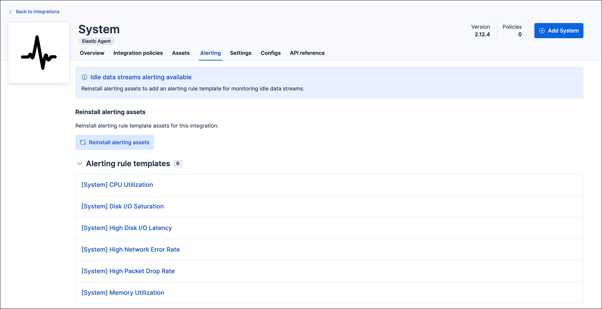
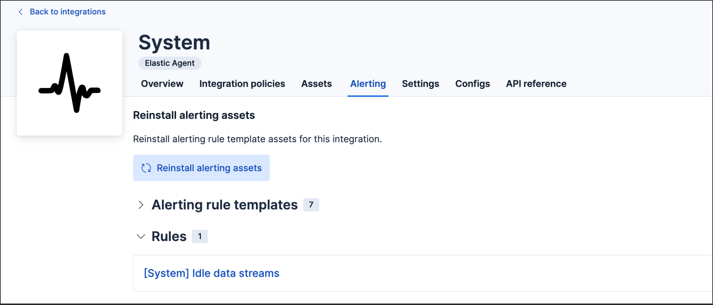

---
applies_to:
  stack: ga 9.2.1
  serverless: ga
products:
  - id: fleet
  - id: elastic-agent
navigation_title: Alerting rule templates
---

# Alerting rule templates [alerting-rule-templates]

Alerting rule templates are out-of-the-box alert definitions that come bundled with [Elastic integrations](integration-docs://reference/index.md), enabling users to quickly set up monitoring without writing queries from scratch. 

Templates help you start monitoring in minutes by providing curated {{esql}} queries and recommended thresholds tailored to each integration. 

After the integration is installed, these templates are automatically available in Kibana's alerting interface with a prefilled rule creation form that you can adapt to your needs.

Although these templates are managed by Elastic, any alert created from them is owned by the customer and will not be modified by Elastic, even if the templates change.

:::{important}
Although the alerts can be used as provided, threshold values should always be evaluated in the context of your specific environment. Depending on how you adjust the thresholds, you might either generate too many alerts or fail to generate alerts when expected.
:::

## Prerequisites
	
- Install or upgrade to the latest version of the integration that includes alerting rule templates.
- Ensure the data collection is enabled for the metrics or events that you plan to use.
- {{stack}} 9.2.1 or later (9.4.0 or later for the **Alerting** tab and **Idle data streams** template).
- Appropriate {{kib}} role privileges to create and manage rules.

## How to use the Alerting rule templates

Alerting rule templates come with recommended, pre-populated values. To use them:

1. In {{kib}}, go to **{{manage-app}}** > **{{integrations}}**.
1. Find and open the integration.
1. On the integration page, select the **Alerting** tab to view all available alerting rule templates for that integration.

    :::{note}
    The **Alerting** tab is available for all integrations starting in version 9.4.0. In earlier versions, alerting rule templates are located in the **Assets** tab.
    :::

    

2. Select a template to open a prefilled **Create rule** form.

    You can use the template to create your own custom alerting rule by adjusting values, setting up connectors, and defining rule actions.

3. Review and (optionally) customize the pre-filled settings, then save and enable the rule.

   The rule created from the template is listed on the **Rules** page. Go to **{{manage-app}}**, then in the **Alerts and insights** section, click **Rules**. Alternatively, you can access rules from solution-specific pages such as **Observability** → **Alerts** → **Manage Rules**.

To update a rule you created from a template, go to the **Rules** page, open the action menu {icon}`boxes_vertical` for the rule, and select **Edit rule**.

The preconfigured defaults include:

- **{{esql}} query**
:   A curated, text-based query that evaluates your data and creates alerts when matches are found during the latest run.
- **Recommended threshold**
:   A suggested threshold embedded in the {{esql}} `WHERE` clause. You can tune the threshold to fit your environment.
- **Time window (look-back)**
:   The length of time the rule analyzes for data (for example, the last 5 minutes).
- **Rule schedule**
:   How frequently the rule checks alert conditions (for example, every minute).
- **Alert delay (alert suppression)**
:   The number of consecutive runs for which conditions must be met before an alert is created.

For details about fields in the Create rule form and how the rule evaluates data, refer to the [{{es}} query rule type](/explore-analyze/alerting/alerts/rule-type-es-query.md).

## Idle data streams template

```{applies_to}
stack: ga 9.4
serverless: ga
```

Starting in version 9.4.0, all integrations include a dynamically generated **Idle data streams** template. This template generates an alert if no data is written to any of the integration's data stream patterns within a specified time period (the default is 24 hours). Note that Idle data streams are not generated for input-only packages. 

Use this template to detect data collection issues early, such as:

- An agent or data source going offline
- Network connectivity problems preventing data ingestion
- Configuration errors stopping data flow

The Idle data streams template:

- Is named `[{Integration name}] Idle data streams`
- Appears in the **Alerting** tab alongside any bundled templates
- Is generated automatically and isn't bundled with the integration



:::{note}
The Idle data streams template monitors all data stream patterns defined by the integration. You can customize the query to monitor specific data streams based on your environment.
:::

## Reinstall alerting assets

```{applies_to}
stack: ga 9.4
serverless: ga
```

If alerting assets are missing or need to be refreshed, you can reinstall them:

1. Open the integration and select the **Alerting** tab.
2. Click **Reinstall alerting assets**.

Reinstalling alerting assets regenerates the Idle data streams template and restores any bundled alerting rule templates to their default state.

:::{note}
You need package management privileges to reinstall alerting assets.
:::
